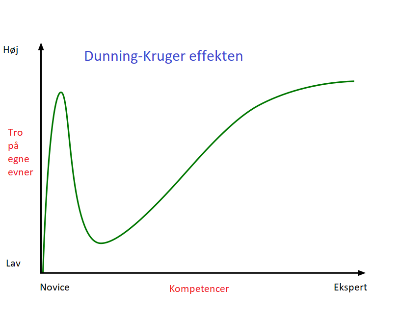
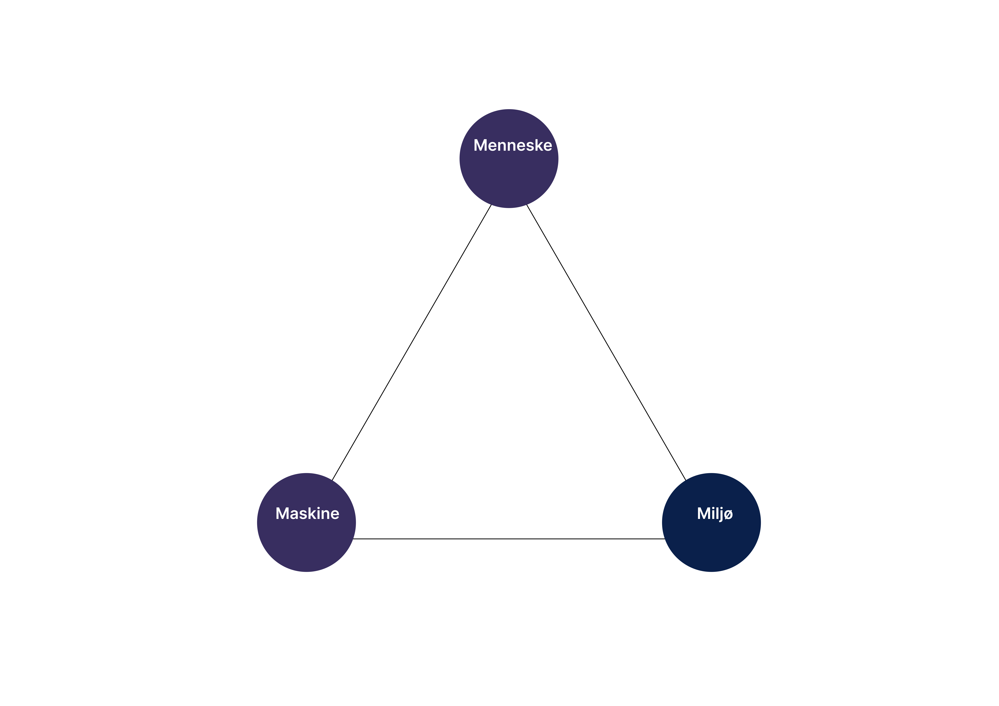

# 1. Indledning
Programmering eller kodning dækker over den process hvor man i et givent programmeringssprog skriver noget kode, som resulterer i et program (eller system). Programmet kan typisk afvikles på en eller flere platforme såsom en computer, en mobiltelefon, en selvkørende bil, en sensor i køleskabet eller noget helt femte. 

Der kan være mange formål med at udvikle programmer. Typisk handler programmering om at automatisere kedelige eller beregningstunge opgaver eller gøre det nemmere for folk at kommunikere, søge information eller træffe bedre og mere kvalificerede beslutninger. 

Eksempler på programmer findes overalt i vores moderne samfund og digitaliseringen af samfundet bliver stadig mere allestedsnærværende. 
Vi interagerer dagligt mange gange med programmer i den ene eller anden form fra handel, sundhed, finans, transport, medier, kunst og kultur. 
Alle domæner af vores samfund er efterhånden gennemsyret af og afhængig af digitale programmer og systemer. Ligesom vi påvirker programmerne, så påvirker programmer også vores adfærd og måde at leve og agere på. 
Derfor, hvis vi skal tackle morgendagens store udfordringer kræver det en bred og divers gruppe af udviklere  på tværs af køn, alder, religiøsitet osv.

Prøv i det følgende at overveje nogle af nedenstående spørgsmål?  

- Når du googler hvem eller hvad er det, der afgør hvad der vises først? 
- Hvordan konstruerer Netflix anbefalinger til næste film? 
- Hvordan virker den selvkørende bil egentlig, når det kommer til stykket? Hvordan kender den forskel på de forskellige objekter udenfor?
- Hvor lang tid mon du bruger på at kigge på en skærm (mobil/computer), hvis du er lige som de fleste andre? 
- Hvordan kan vi være sikre på, at de private beskeder vi sender til hinanden rent faktisk er private?
- Bør vi kunne stemme digitalt ved næste valg? Hvad kan udfordringerne være?
- Hvordan identificerer vi fake news?

Målet med denne bog er ikke nødvendigvis, at gøre alle til professionelle programmører, men håbet er at give læseren en sjov og måske lidt anderledes introduktion til programmering og kode, som tidens helt centrale metodefag, der kan efterhånden bruges som værktøj i stort set alle fag. 

Ved at give læseren en grundlæggende, digital skaberkompentece, muliggøres det, at skabe værdi for den enkelte, som den pågældende kan drage nytte af indenfor sit domæne, vidensfelt eller interesseområde. Hvis vi kan så et frø, der på sigt kan rykke nogle til at blive professionelle udviklere, så går vi selvfølgelig ikke i vejen for det.

Det handler i sidste ende om, at være med til at oplyse og skabe demokratiske medborgere, der har en principiel eller grundlæggende forståelse for hvad kode er og hvordan systemer er opbygget, men som også kan forholde sig kritisk og reflekterende i fht udviklingen af ny teknologi. 

## Det tager 10 år at blive en dygtig programmør!
Denne bog har som nævnt ikke til hensigt, at gøre dig til en professionel programmør, men gør dig bedre i stand til at vurdere, om det måske er noget du har lyst til at arbejde videre med på sigt.

Vær på vagt overfor folk, der påstår, at man kan lære et nyt sprog i løbet af få timer, dage eller et kursus på nogle uger. Kigger man på den gængse litteratur indenfor programmering finder man utallige eksempler på bøger med titler ala "lær dig sprog X i løbet af 24 timer", hvor X kan erstattes med passende sprog såsom Javascript, Python, Java, C++ osv. Ændres timer til dage så er der endnu flere.

På 24 timer kan man måske nå at sætte sig ind i noget af den grundlæggende syntaks og sprogets opbygning, men næppe tid til at skrive særligt mange signifikante, ikke trivielle programmer, tid til at fejlrette eller lære af mere erfarne programmører eller tid til at forstå den dybere forskel på korrekte og effektive programmer vs. korrekte, men ineffektive løsninger eller tid til at forstå sprogets standardbibliotek eller til at leve og arbejde i et udviklingsmiljø med alle de muligheder det giver for debugning og fejlretning. 

Det korte af det lange er, at du efter 24 timer allerhøjest vil have nået en særdeles overfladisk og ikke særlig dyb viden. Som den engelske poet, Alexander Pope, skrev det, så kan lidt viden være en farlig ting. Særligt hvis det får en til at tro eller overvurdere egne evner, fordi nogle måske kan have tilbøjelighed til ikke at øve sig nok eller få godt nok styr på det fundamentale. 
Det er en velkendt psykologis bias eftervist eksperimentelt af de to psykologer Dunning og Kruger (se figuren nedenfor), at mindre kompetente individer indenfor en lang række domæner, har en tilbøjelighed til at overvurdere egne evner. Effekten er vigtig at kende til på alle stadier af ens udvikling som programmør, fordi vi ellers risikerer at undervurdere kompleksiteten af ​​et system eller det skaber et ego, der gør at vi tror, at vi ved mere end vi gør, og det hindrer os i at søge hjælp til koden, når vi måske har brug for det. 

Vi skal med andre ord øve os i det fundamentale, fordi kun når det fundamentale er godt nok på plads, begynder de mere avanceret og videregående emner at give mening.

Rigtig megen forskning peger på, at det ofte tager 10.000 timer eller 10 år at udvikle ekspertise indenfor et felt om det er komponering af musik, sport eller fag. 
Programmering er ingen undtagelse. Langt hen ad vejen kan vi tænke på programmering, som et håndværk. Man kan måske nok lære ret hurtigt at forstå hvordan værktøjerne virker, men rent faktisk at kunne bruge dem til at lave noget ikke-trivielt af værdi, kræver, at man træner og øver sig i meget, meget lang tid. For nogle kortere end andre, men det tog stadig Mozart, der blev opdaget som et musikalsk geni, som 4 årig, næsten 13 år mere før han begyndte at skrive verdensklasse musik. 

For at blive en god programmør og få succes med programmering, så vil vi foreslå følgende:

- Bevidst træning i den forstand, at man udfordrer sig selv med nye og svære opgaver, prøver at løse dem og analysere hvad der gik galt. Og gør det så igen, igen og igen Til hvert kapitel i denne bog er der en række øvelser, som har en stigende progression, så de kan være et godt sted at starte. Lad være med at springe over. Få styr på det fundamentale først!
- Programmering læres bedst ved at gøre det selv. Find nogle opgaver som du synes kunne være interessante at lave. Det vigtigste er, at programmering skal gerne være sjovt også efter de første 10.000 timer.
- Læs andres kode og forstå det til bunds
- Tal med andre programmører og arbejd med andre programmører på projekter både før og efter. Der findes en lang række open source projekter derude, som du kan bidrage til.
- Når først du har øvet dig en del i et sprog, så prøv at lære et eller flere andre sprog. Gerne sprog med forskellige tilgange til processen. 
- Giv ikke op. Men bliv ved med at øve dig.
- Vær vidende om, at alle dygtige programmører har på et eller andet tidspunkt været der hvor du er nu. Du er ikke alene.

Ønsker du altså på sigt at blive en ekspert indenfor programmering, så se i øjenene, at ægte ekspertise kan tage et helt liv eller som digteren, Samuel Johnson formulerede det: "Ekspertise i enhvet fag kan kun opnås ved et livs arbejde; det kan og skal ikke købes til en lavere pris."

## Valg af sprog
Når man skal lære at programmere er et af de første store spørgsmål, hvilket sprog man bør tage fat på. Der findes ikke noget entydigt godt sprog at starte på. Nogle sprog er dog stadig nemmere at lære end andre. Der findes i dag flere hundrede forskellige sprog og valget af sprog afhænger i høj grad hvad man ønsker at lave eller bruge det til. Selvom alle sprog er unikke er mange af dem og så meget ens, og forstår man først de grundlæggende principper i et sprog, så har man typisk nemmere ved at overføre det til et andet.

Man kan inddele sprog i lavniveau og højniveau sprog, som indikerer hvor tæt vi er på den egentlig maskinkode. Jo lavere niveau, jo tættere er vi på noget kode som maskinen forstår. Jo højere niveau, jo længere væk er vi fra den meget maskinnære syntaks.

Nærværende kompendie bruger højniveausproget Javascript og biblioteket P5.JS, som på mange måder minder om Processing i Java. Det er der en række grunde til, som vi kort vil komme ind på herunder.

- Javascript er med et fint ord dynamisk fortolket. Det kan betragtes som en form for syntaktisk sukker, der gør det nemmere at komme i gang. Når man eksempelvis vis skal erklære en såkaldt variable (en navngiven plad i computerens hukommelse), så behøver man ikke bruge så meget krudt på at fortælle hvilken type data, der gemmes. I andre sprog, såsom Java, der er statisk typet, skal man erklære typerne på forhånd. Vi kan tænke på Javascript, som den gamle, søde mormor, der tillader os at gøre ret meget, mens Java er der noget mere strikse og disciplineret militærsergent, som kræver hård disciplin.
- Javascript er nemt at afvikle i din browser og kan afvikles på stort set alle platforme. Det kan bruges til at udvikle alle mulige slags applikationer.
- Ved brug af biblioteket P5.JS får vi mulighed for skrive kode, der i højere grad lader sig visualisere. Det kan hjælpe på forståelsen for mange, og man kan tidligere i læringsprocessen lave nogle mere interessante og spændende programmer med input fra tastatur, mus, fingre osv. fremfor at kunne skrive "Hej verden" på som det ofte er traditionen, at man starter med i de fleste sprog.
- Der findes et enormt community til både Javascript og P5, så det er nemt at få hjælp og man kan nærmeste lave hvad som helst ved brug af forskellige opensource værktøjer.
- Når man føler sig klar er der mulighed for at arbejde videre i P5 miljøet ved brug af eksempelvis Python eller Java til Processesing.

## Gode råd til at blive en bedre programmør

Programmering handler i bund og grund om problemløsning og at formulere denne løsning i kode, så computeren kan forstå det. Det er på mange måder en sjov, lærerig og tilfredsstillende proces, som dog først rigtig bliver levende når man selv sætter sig foran keyboardet. Programmering er tidskrævende og man vil begå fejl undervejs, men i takt med at man bliver dygtigere vil fejlene blive færre og produktiviteten større.
Herunder nogle gode råd til når du sidder fast i udviklingsprocessen: 

- Har du et problem, som du ikke umiddelbart kan finde en løsning på, så start med at google problemet/fejlen. Der findes med garanti andre derude, som har haft samme problem som dig, så hvis du ikke kan finde svaret så overvej hvordan du google spørgsmålet. 
- Hvis ikke Google kan hjælpe, så prøv at spørg en anden programmør.
- Hvis der ikke er en anden programmør til rådighed, så prøv at fortæl en anden, der gider at lytte. Det hjælpe ofte at sætte ord på sine problemer.
- Brug gerne del og hersk princippet. Har du et problem som du ikke kan løse, så prøv at dele det ind i mindre problemer, som du måske så bedre kan løse.
Prøv altså at reducere problemet til et mere simpelt problem og løs det først.
- Hold tingene så simple som mulige men hellere ikke simplere (KISS - Keep It Simple and Straight)
- Indse at Programmering = Kode + Problemløsning. Det er altså ikke nok at have styr på koden. Du skal også have en forståelse af hvordan problemer mere generelt kan løses og du skal have styr på den underliggende teori bag det givne problem. I kapitlet om computationel tænkning kigger vi på klassiske problemløsningsteknikker og hvordan man systematisk kan arbejde med at løse problemer.
- Lær at bruge et udviklingsmiljø og de mange muligheder det tilbyder. Brug miljøets mulighed for at debugge og finde fejl let
- Læs sproget dokumentation eller vær klar over hvor du kan slå tingene op
- Hold pauser i ny og næ. Din underbevidshed arbejder stadig for dig
- Test regelmæssigt - for ikke at sige hele tiden
- Brug et versioneringssystem ala Github, der giver mulighed for at synkronisere kode på tværs af computere let. Det giver dig mulighed for at arbejde hvor som helst når som helst.
- Først får vi programmet til at virke, så gør vi det korrekt og til sidst effektivt.

## Javascripts afvikling i en browser
Det kan være en fordel, at man ved lidt om opbygningen hvorledes kode i javascript afvikles i browseren inden man går i gang med at skrive kode selv.
En browser eller webbrowser ala Google Chrome, Firefox etc. har det grundlæggende formål at fremvise HTML hhv. CSS, der står for HyperText Markup Language hhv. Cascading Styling Sheet, der er to sprog til at opbygge hhv. style hjemmesider.
Browserens opgave er altså at rendere eller fremstille koder udfra disse sprog, så det man ser er hjemmesiden og ikke de egentlige HTML koder eller CSS koder. Faktisk kan Javascript være direkte involveret i HTML, så det kan være en god ide at vide en smule om HTML.
Udover renderingsmotoren har langt de fleste browsere også en såkaldt Javascript fortolker, som kan afvikle Javascript programmer. Renderingsmotoren kan kalde Javascript fortolkeren, når det er nødvendigt. 
Dvs. overordnet foregår afviklingen af Javascript kode i følgende trin:

1. Kode skrevet i javascript indlæses 
2. Fortolkeren kaldes og sættes i gang med at fortolke og oversætte koden linje for linje
3. Kompileren (som står for at oversætte koden til den binære kode, der er læsbar og kan forstås af maskinen) modtager koden og begynder at optimere og kompilere koden 
4. Kompileren optimerer inkrementelt på koden

Kompileren er en såkaldt Just-In-Time kompiler, der dynamisk oversætter i mens programmet kører (også kaldet "run time"). Der findes andre typer kompilere, som oversætter og optimerer al koden til maskinkode inden programmet kører. 

## Udviklingsmiljø
Vi starter med blot at bruge editoren eller tekstfeltet, der er tilgængelig på P5JS. Den er simpel og let at komme i gang. Vigtigst er i første omgang at få skrevet noget kode og det er samtidig nemt at både dele og hente andres programmer, så man kan lade sig inspirere. 

Herefter tager vi hul på brug af Visual Studio Code, som det såkaldte udviklingsmiljø, hvor vi skal have følgende plugins (tryk Ctrl+Shift+P):

1) Live Server til at afvikle en lokal webserver
2) P5 Project Creator: Til nemt at konstruere P5 projekter.
3) p5js Snippets: Til nemt at indsætte ofte brugte kodestumper ind automatisk

Vi giver en grundig indføring i installationen og brugen af både online editoren samt Visual Studio Code og de nødvendige plugins i kapitel 17.

## Læsevejledning
Generelt anbefales det at følge de første ni kapitler i den rækkefølge. Her introduceres de grundlæggende strukturer, som er essentielle for at kunne kode. Man kan undervejs dykke ned i kapitlerne 11-16, som langt hen ad vejen kan læses uafhængigt af hinanden. 
Det kan være en god ide relativt tidligt i sin læringsproces at få en forståelse for dokumentation og testning samt de grundlæggende problemløsningsteknikker og den måde vi tænker og arbejder computationelt.

Ved hvert kapitel er der en række øvelser og større projekter. Det anbefales at lave så mange øvelser som muligt og gerne de projekter, som man finder interessante. Projekterne, er generelt noget større og åbne opgaver.

## Øvelser
1. Overvej nogle eksempler fra din hverdag hvor du i et eller andet omfang interagerer med programmer. Hvorledes påvirker disse programmer mon din eller andres adfærd?
2. Hvorfor er det vigtigt, at vi får en bred og divers gruppe af udviklere til at kode fremtidens løsninger?
3. Giv tre eksempler på hvor programmering kan bruges til at automatisere kedelige opgaver.
4. Giv tre eksempler på hvor programmering kan bruges til at gøre noget skidt eller hvor en programmør kan have ondsigtede intentioner?
5. Brug trekantsmodellen illustreret nedenfor til at kvalificere og belyse nogle af spørgsmålene formuleret i indledningen. 
Modellen har tre hjørner: Menneske, maskine og miljø. Med maskine skal forstås noget, som i en eller anden form (software eller hardware) er automatiseret ved brug af noget kode og miljø betegner de ydre forhold som omgiver os. Det kan eksempelvis være samfundet og kulturelle forhold og normer. 

6. Hvad er forskellen på lavniveau og højniveau sprog? Hvorfor er det en god ide at starte i et højniveau sprog?
7. Prøv at kigge på følgende to sider,  [tiobe index](http://tiobe.com/tiobe-index/) og [github](https://githut.info/), som rummer statististikker over de mest anvendte sprog netop nu. Hvorfor ligger Javascript mon nr 7 på den ene og nr 1 på anden?
8. Prøv at google historien bag udviklingen af sprogene C++, C#, og PHP. Kan du finde en sammenhæng?
9. Som nævnt tidligere så handler programmering i høj grad om at hjælpe mennesker. Forestil dig nu, at du skal skrive et program, der kan hjælpe en person lider af locked-in-syndromet (dvs. vedkommende kan reelt kun  bevæge øjnebrynene), med at skrive en bog. Det lyder måske umuligt, men var ikke desto mindre tilfældet for Jean-Dominique Bauby, da han skrev den fremragende bog, Dykkerklokken og sommerfuglen. Forestil dig, at programmet kan opfange når der blinkes og hvor mange gange det sker. Dvs. vi kan bruge blink til at indikere hvilket bogstav nr i alfabetet. Ved brug af såkaldt lineær søgning kunne 1 blink svarer til et a, 2 til b, 3 til et c osv. Det vil være ret ineffektivt. Hvorledes kunne vi gøre det smartere (altså med færre blink)? Mon en med locked-in-syndromet overhovedet ville være interesseret i at bruge et sådan program?
10. Der kan være mange vej til Rom. På samme måde kan et program have mange forskellige løsninger. Det skal denne øvelse illustrere. Øvelsen kan være god at lave med en anden. Tegn et kvadrat bestående af 8*8 mindre kvadrater vha noget kridt på asfalt. Brug evt noget papir, hvis du er alene. Sæt den ene person i et af kvadraterne og en bold eller noget et andet sted. Nu skal du som programmør skrive noget kode, der får den anden over til bolden. Du må kun bruge instruktionerne F samt V/H for hhv. Fremad og til Venstre/Højre betyder at du roterer 90 grader men bliver i samme felt. Programmet må først køres, når du har skrevet det færdig. Hvis du ikke når i mål, så prøv at debugge eller finde fejlen. Bemærk, der er undelige mange korrekte løsninger til programmet og uendelig mange forkerte. 
11. Udvid nu ideen fra 10. så du skal have en robot eller lignende til at hente dig en kop vand eller lignende. Du må gerne selv finde på nogle nye instruktioner. En god instruktion at tilføje kunne være "Gentag følgende sålænge at ", der gentager instruktioner et vist antal gange. Prøv dit program af i praksis.
12. Ofte har man brug for at sortere tal i stigende rækkefølge.  Det sker faktisk rigtig mange gange i løbet af en dag, når man googler, ser transaktioner på sin netbank, sorterer sit musikbibliotek osv. Tag nogle kort fra et kortspil eller en gruppe af mennesker med forskellige højder, der hver repræsenterer et unikt tal. Prøv at overveje et program og et entydigt sæt af instruktioner, der gør det muligt at sortere kortene eller menneskene i stigende rækkefølge. Prøv dit program af i praksis. Hvad gik godt og hvad gik mindre godt?

