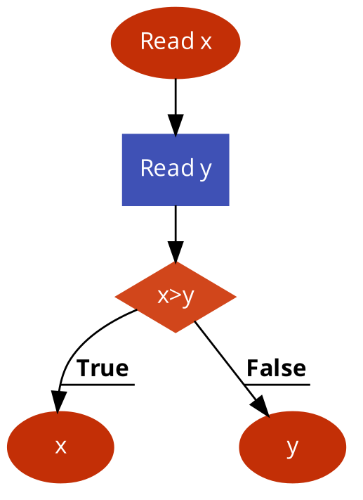
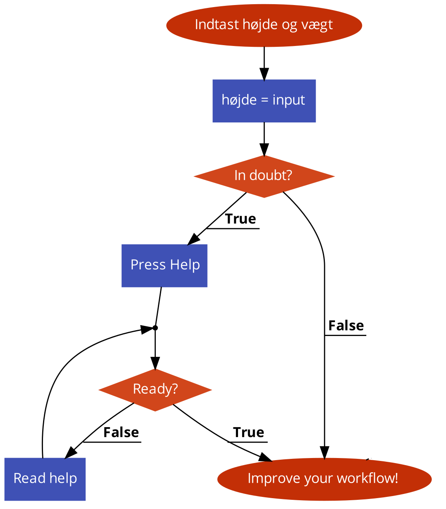

# 11. Dokumentation og kravspecifikation
Dokumentation af ens kode og programmer består typisk af skreven tekst og illustrationer knyttet til koden, og spiller en central rolle i softwareudvikling i forhold til at kommunikere med andre udviklere, slutbrugerne af programmerne, andre aktører eller dig selv. Du vil blive overrasket over hvor hurtigt man glemmer hvad man egentlig tænkte, da man skrev koden for uger eller bare dage siden. 

Målene med dokumentation kan bl.a. være at forklare: 

- Kravspecifikation: Hvilke krav stilles til systemet/brugeren m.m.
- Programmets opbygning: Hvordan er programmet overordnet opbygget (arkitekturen bag) og hvorledes fungerer enkeltdelene herunder funktioner, klasser, algoritmer osv.
- Slutbrugermanual: Hvordan bruges programmet.
  
I det følgende vil vi gennemgå hvorledes disse tre punkter kan dokumenteres og indføre nogle værktøjer/modeller, som kan være relevante at bruge i formidlingen.

Ligesom dokumentationen er væsentlig er det mindst ligeså essentielt at få udformet en ordentlig kravspecifikation inden man starter udviklingen. Det er kravspecifikationen der sætter de overordnede rammer og mål for projektet. Man kan være nok så dygtig en programmør, der kan skrive tusindvis af linjers kode i løbet af ingen tid, men hvis målene ikke er klare, kan det hurtigt ende galt. Som den indisiske politiker Gandhi formulerede det, så uanset hvor hurtigt du skrider frem, når du ikke din destination, hvis du ikke går i den rigtige retning. 
Vi dedikerer derfor sidste del af dette kapitel til at folde arbejdet med kravspecifikationen lidt ud og beskrive nogle gode værktøjer, som er relevante at inddrage i processen. 


## Programmets opbygning
I det følgende kigger vi på hvorledes man kan dokumentere og formidle sin kode på et kodenært niveau. 

### Indlejret kommentarer til kildekoden
Et vigtigt værktøj til at dokumentere sin kode er ved brug af inline kommentarer. De kan bruges efter behov og er særligt relevante ved mere komplekse instruktioner. Man bør generelt undgå at kommentere alt for meget, da det også kan forstyrre forståelsen. Ved større funktioner eller klasser kan man skrive over den overordnede definition af disse, nogle linjer der i grove træk skitserer hvad disse gør. 

Til et hvert større sprog findes guides eller regler for hvorledes god kode bør skrives og dokumenteres. Det kan være alt fra hvorledes man bør navngive sine variabler, til indenteringen, til hvor man skifter linje. Det er vigtigt, at man i den sammenhæng husker at være konsistent og konsekvent i brugen af de valgte regler.
Et vigtigt aspekt ved god kode er, at det også er læsbar kode. 

Pas med andre ord på kommentarer, der bruger mange linjer på at forklare hvad koden gør. Hvis koden er så uklar, at den skal uddybes for meget så er det måske et tegn på, at den bør omskrives. Undgå altså gerne kommentarer såsom følgende: 

```javascript
// Denne kode vil gøre det her (....) og det her (....)
// og hvem ved hvad den ellers gør
//...
```
Prøv i stedet at give en høj niveau beskrivelse af kontrolflowet i forskellige situationer. Herunder et eksempel for en funktion der udregner summen af to tal:
```javascript
/**
 * Returnerer summen af to tal x og y.
 *
 * @param {number} x Den første operand skal være et reelt tal.
 * @param {number} x Den anden operand skal være et reelt tal.
 * @return {number} x Udregner summen af x og y.
 */
function plus(x, y) {
  ...
}
```

Ved at gøre brug af denne notation kan man gøre brug af markup-sproget JSDoc se <https://jsdoc.app/>, som giver mulighed for let at autogenerere dokumentation via html-sider. 
Har man installeret JS Doc kan man reelt bare skrive
```javascript
jsdoc navn_på_fil.js
```
Hvor "navn_på_fil.js" skal erstattes af den konkrete javascript-fil, så genereres automatisk en html side med dokumentation i samme bibliotek. Ydermere understøtter de fleste udviklingsmiljøer (herunder VS code) JSDocs notation, så man kan få autogenereret kode fremover ved at benytte JSDoc. Øvelserne vil gå mere i dybden med brugen af JSDoc. 

Når man bruger JSDoc bør man også overveje, hvilket sprog man skriver sine kommentarer i om det eksempelvis skal være dansk eller engelsk. Generelt er det en god ide at skrive på engelsk, da nøgleordene også er på engelsk og en langt større grupppe af udviklere forstår engelsk fremfor dansk. Vi varierer lidt i denne tekst, da der er tale om en lærebog og at understrege, at det grundlæggende også er ok, at bruge dansk. Man skal bare være opmærksom på det og passe på med at blande engelsk og dansk i kommentarer eller kode.  

Herunder et lidt større eksempler hvor der indgår klasser og metoder i dokumentationen ved brug af JS Doc.

```javascript
/** Class that represents a circle. */
class Circle {
    /**
     * Constructs a circle
     * @param {number} x - Circles x coordinate.
     * @param {number} y - Circles y coordinate.
     */
    constructor(x, y) {
        // ...
    }

    /**
     * Gets x-value.
     * @return {number} x-value.
     */
    getX() {
        // ...
    }

    /**
     * Get y værdien.
     * @return {number} y-value.
     */
    getY() {
        // ...
    }

}
```
Herunder et eksempel på nedarvning fra ovenstående klasse:

```javascript
/**
 * Class that represents point
 * @extends Cirkel
 */
class Point extends Circle {
    /**
     * Creates a point (circle (without radius)).
     * @param {number} x - value.
     * @param {number} y - value
     * @param {number} c - value.
     */
    constructor(x, y) {
        // ...
    }

    /**
     * Gets color of point.
     * @return {number} color of point in colorcode.
     */
    getColor() {
        // ...
    }
}
```
### Refaktorisering
Som det blev nævnt tidligere, så er god kode ofte kendetegnet ved at være relativt selvforklarende og lettere tilgængeligt. Derved bliver dokumentationsbehovet reduceret. Med andre ord fremfor at skrive en masse kommentarer kan man nogle gange også lave en såkaldt refaktorisering af sin kode for at gøre den mere læsbar. `Refaktorisering` betegner den proces hvorved man omskriver kode, så den er mere enkel og lettere at forstå.  
Herunder et eksempel på kode, hvor man kan reducere behovet for dokumentation ved at refaktorisere.  Først den oprindelige version:
```javascript
//Version 1:
function listPrimes(N) {
  for (let i = 2; i < N; i++) {
    // checks if the integer i is a prime number
    for (let j = 2; j < i; j++) {
      if (i % j == 0) continue nextPrime;
    }
    console.log(i)
  }
}
```
Løkker inde i løkker kan ofte være svære for nogle at forstå og kan gøres mere læsbare og forståelige, hvis man deler det op i mindre bider. Eksempelvis kan man sætte den inderste løkke ind i en funktion:
```javascript
function listPrimes(N) {
  for (let i = 2; i < N; i++) {
    if (!isPrime(i)) continue;
    console.log(i)
  }
}

function isPrime(N) {
  for (let i = 2; i < N; i++) {
    if (N % i == 0) return false;
  }
  return true;
}
```
Her har vi sat den inderste løkke, der tjekker om tallet `N` er et primtal. 

Et andet eksempel kunne være hvor vi har løkker efterfulgt af hinanden. Her kan det ofte være hensigtsmæssigt refaktorisere løkkerne til funktioner. 

```javascript
let Lx= []
let Ly= []
let n = 20
for(let i=0;i<n;i++)
{
    let x = random(i,i+5)
    Lx.push(x)
    let y = random(i,i+5)
    Ly.push(y)
}

beginShape(LINES);
    for(let i=0;i<n;i++)
    {
        vertex(Lx[i],Ly[i])
    }
endShape();
```
I sådanne tilfælde kan det være bedre at konstruere nogle funktioner der erstatter løkkerne:

```javascript
function generatePoints(n)
{
    for(let i=0;i<n;i++)
    {
        let x = random(i,i+5)
        Lx.push(x)
        let y = random(i,i+5)
        Ly.push(y)
    }
}

function drawLines(n)
{
    beginShape(LINES);
        for(let i=0;i<n;i++)
        {
            vertex(Lx[i],Ly[i])
        }
    endShape();
}
```

### Pseudokode
Pseudokode betyder frit oversat "ikke ægte kode". Det er formuleret i almindeligt engelsk, dansk eller et tredje sprog, og udgør en mere abstrakt højniveau beskrivelse af koden, som er lettere tilgængelig end den egentlige kode. 
Det er kendetegnende for pseudokode, at det typisk er formuleret, så det er uafhængig af programmeringssprog. Pseudokoder bliver brugt i stor stil i videnskabelige tekster og lærebøger til at kommunikere og formidle centrale ideer og hvorledes de kan omsættes til kode. 
Pseudokode bruges ofte til at formidle mere komplekse stykker kode, der løser et mere generisk problem. Et godt eksempel herpå er algoritmer, som er en afsluttet sekvens af instruktioner, der løser et problem eller udfører en konkret opgave. Herunder et eksempel på pseudokode for en algoritme der ligger to tal sammen:

1. Indlæs to tal
2. Adder tallene 
3. Print resultatet

Eller algoritmen for at lave te:
1. Tag 1 tepose og placer den i en kop
2. Hæld kogende vand ned i koppen
3. Lad den trække i 5 minutter
4. Tag teposen op af vandet og smid den ud

Endelig også et højniveau eksempel på hvorledes vi kunne konstruere Fibonacci-talfølgen, som er langt fra egentlig kode:

```javascript
// Version 1: Højniveau pseudokode for Fibonacci 
Fibonnaci:
1. Indlæs tallene 0 og 1
2. Konstruer en talfølge, hvor næste element er summen af de to foregående. 
```

Disse stumper pseudokode er særdeles højniveau og ligger langt fra den mere programmeringsnære variant af pseudokoden, som vi skal se senere. Skulle disse tre linjer implementeres i praksis ville de fylde betydeligt mere. 
Den gode pseudokode er typisk kendetegnet ved en fornuftig balance mellem kompleksiteten af den løsning man for søger at beskrive med deltaljegraden af pseudokoden i forhold til den målgruppe, som man skriver til. 

Pseudokode minder om rigtig kode i den forstand, at den inddrager typiske nøgleord fra programmering såsom `if-else`, `while`, `for` m.m. og dermed induceres mere eller mere direkte en struktur for programmet men man abstraherer for en række væsentlige detaljer såsom valg af datastruktur etc. Det gøres med henblik på at gøre det nemmere at kommunikere det overordnede dataflow i ens program/algoritme. 

Man kan tænke på pseudokode som et skelet for rigtig kode, der kan oversættes til maskinekode uden at gøre noget. God pseudokode skal gerne gøre det nemmere og hurtigere at implementere den givne algoritme i ægte kode. 

Herunder et eksempel på pseudokode for fibonacci-funktionen, hvor vi i højere grad begynder at nærmere os egentlige kode. Vi klassificerer derfor koden som værende på mellemniveau. 

```javascript
// Version 2: Mellemniveau pseudokode for Fibonacci 
Fibonacci (n):
    loop mellem 0 og n
        sum de to tidligere fibonacci tal
        når vi når n, returneres værdien
```

Vi er stadig et stykke fra rigtig kode, men vi begynder at se strukturen af et egentligt program. Der er en række uklarheder såsom at summe de to tidligere fibonacci tal. 

Herunder et endnu mere kodenært eksempel, hvor vi tydeliggøre nogle af uklarhederne. Da vi er meget nær rigtig kode kaldes denne version for lavniveau:

```javascript
// Version 3: Lavniveau pseudokode for Fibonacci 
function Fibonacci(n):
    if n er 0 eller 1, return 1

    // indlæs de første to fibonacci tal
    f1 = 1
    f2 = 1

    loop fra 2 til n:
        fibi = f1 + f2
        //Opdater tidligere fibonnaci tal
        f2 = f1
        f1 = fibi

   return fibi
```

Udfra denne pseudokode burde det være muligt ret hurtigt at implementere fibonacci i praksis. 

Der findes ingen fast konvention for hvorledes pseudokode skal se ud, men det er vigtigt, at valget af syntaks er konsekvent og konsistent. 

#### Regler for pseudokode
Selvom der ikke findes nogen entydige krav til syntaksreglerne i pseudokode kommer herunder en række forslag, som kan være gode at følge. 

- Første trin i pseudokode er at finde et navn til sit program. Typisk bruges navne der benytter CamelCase, dvs. starter med stort og består af to ord. Det andet ord starter også med stort. Eksempel. InsertionSort, SelectionSort der beskriver to forskellige sorteringsalgoritmer (dvs programmer der sorterer tal i stigende/faldende rækkefølge) etc.

- Når vi designer pseudokode antager vi at koden udføres sekventielt. Det gør vi ret ofte, når vi designer algoritmer. Såfremt man skriver pseudokode, der kan afvikles parallelt af flere computere bør man gøre opmærksom på det i pseudokoden. 

- Pseudokode varierer i stil fra programmør til programmør, men man låner typisk i sin syntax fra programmeringssprog såsom Python, Java, C++ og lignende. 
Selvom pseudokode generelt skal være sproguafhængig kan det stadig være en god idé at låne den syntax, man skal lave selve koden i. Skal man eksempelvis skrive et Python program, kan man låne den syntax en smule til sin pseudokode

- Prøv at (meta-)kommuniker allerede igennem navngivningen af metoder/funktioner/algoritmer eller lignende, hvad de gør samtidig med, at navnene skal  letforståelige og sigende.  F.eks. er det helt indlysende bedre at give en funktion, der adderer noget sammen titlen  "sum()" fremfor eksempelvis et tilfældigt navn som "x3j67()". Husk på at hele ideen med pseudokode er at gøre koden lettere tilgængelig for andre.
Hvis et navn er sammensat af mere end et ord, kan man starte andet ord med stort eller lave en underscore f.eks.
"squareRoot()" eller square_root()"

- Navngivning og initialisering af variable: Variabler skal også have letforståelige og sigende navne f.eks. navn, alder, højde. Hvis variablen har mere end et ord kan man starte andet ord med stort såsom forNavn eller efterNavn. Erklæring (Initialisering)  af variabler kan gøres ved brug af eksempelvis nøgleordet Set, hvor man gerne må give den en værdi med det samme.Det kunne være Set sum = 0
-  Hvis man skal erklære mange variabler kan det være en god ide at gøre det på samme linje, så som:
```javascript
sum = 0, Set x = 0, Set y = 0, Set z = 0, Set isCube = FALSE
```
    En sådan erklæring eksekveres fra venstre til højre.
- Man kan læse data fra variabler, lister eller lignende ved brug af et nøgleord som READ. Herunder eksempler:
    ```javascript
    Read: Liste af variabler
    Read: x
    Read: x,y,z
    ```
- Tilsvarende kan man præciserere output ved brug af eksempelvis `Print` eller `Write`. Herunder et eksempel: 
    ```javascript
    Print: Besked eller Variabel
    Print: ”Hello World” //Besked
    Print: x, y	       //Variabler	
    Write: Besked eller Variabel 
    Write: ”Hello World”       //Besked
    Write: ”Værdien er”, x	 //Besked og variabler
```
- Undgå generelt at skriv mere end et udsagn pr. linje. Det gør generelt pseudokode nemmere at læse for de fleste.  
- Sæt evt nøgle ord med store bogstaver eller fed skrift (såsom `READ`, `WRITE`, `IF`, `WHILE`, `FOR`).
- Ryk ind eller tabuler for at vise hierarkiet i ens kode. Særligt relevant når man eksempelvis har betinget udførsel, løkker eller funktioner i sin pseudokode. 
- Afslut flere linjers strukturer. Har man eksempelvis en `IF` betinget udførsel er det en god ide at slutte med eksempelvis `END IF` eller lignende.  
- Undgå at blande forskellige sprog i sin pseudokode. Dvs. undgå eksempelvis at blande dansk og engelsk. 
- Overvej hvem din målgruppe er og hvilken detaljegrad af pseudokoden, der er relevant. Skal man kunne implementere pseudokoden selv eller er hensigten mere at formidle en ide eller et koncept?

### Prosakode
Prosakode er en mindre kodenær beskrivelse. Der stilles ingen krav til, at man bruger bestemte keywords eller lignende. Vigtigste er dog, at prosakoden faciliterer og understøtter en forståelse af hvorledes man kan skabe en overordnet struktur for programmet. 
Det er også muligt at kombinere prosakode og pseudokode. 
Herunder et eksempel på prosakode for en funktion, der givet en streng returnerer hvorvidt det er et palindrome eller ej:

Givet en streng $s$ som input. Vores program gør da følgende: 
** 1. Tjek først om strengen $s$ består af et eller flere tegn. Hvis den er tom eller kun består af et tegn returner da sandt.
** 2. Hvis den består af flere tegn sammenlign første og sidst element. Hvis de to elementer er forskellige returnes falsk. Ellers fjern dem fra strengen og start algoritmen forfra men nu med den reducerede streng som input.

### Flowdiagrammer
Flowdiagrammer eller rutediagrammer kan bruges til at lave en visuel repræsentation af  programmets flow, der grundlæggende er uafhængig af det valgte sprog, hvilket muliggør at programmører i andre sprog kan gøre brug af diagrammet. 

Det kan være en ide at bruge, når man skal illustrere eller dokumentere mindre mere komplekse stykker kode til andre programmører. 
Den klare ulempe ved flowdiagrammer er, at jo større stykker af kode man forsøgere at visualisere med flowdiagrammer, jo mere kompleks og til tider uoverskuelig risikerer flowdiagrammet at blive. Som supplement til pseudokode og prosakode er flowdiagrammer rigtig gode.

Flowcharts tegnes generelt fra toppen til bunden
Alle elementer (æsker) skal forbindes med pile (Flow kontrol)
Alle flowcharts starter med et Terminal eller Proces element
Beslutningselementer har 2 udgange – en til sandt/ja (TRUE) og en til falsk/nej (FALSE)

Herunder eksempler på forskellige figurer der indgår i flowdiagrammer og efterfølgende eksempler på hvorledes de kan sættes sammen til et konkret stykke kode, der gør noget. 

- Terminal: Indikerer start eller slutning på algoritmen.  Vi tegner en terminal og skriver ”START” inden i den for at indikerer starten af flowchartet. På samme måde skriver vi ”STOP” inde i den terminal der afslutter flowchartet
- Data eller Input/Output (I/O). Viser at denne instruktion tager et input eller viser et output		
- Proces. Indikerer en intern instruktion som f.eks. Initialisering, beregning eller lignende	
- Beslutning. Bruges til at stille et spørgsmål der enten er sandt (TRUE) eller falsk (FALSE). F.eks. Er du online? Svaret er enten ja (TRUE) eller nej (FALSE)	
- Forbindelse. Bruges til at forbinde flowcharts der fylder mere end én side. Man kan skrive: Til Forbindelse 3 på side 2.		
- Flow kontrol. Viser retningen I flowet fra en kasse til en anden


Herunder nogle eksempler på flowdiagrammer. 

I det første eksempel indlæses to tal og vi returnerer det største:



Herefter et kodenært flowdiagram for Fibonacci-funktionen:


### Brugerhistorier
Brugerhistorier beskriver en afgrænset interaktion mellem brugeren og systemet og kan være relevante at inddrage i sin dokumentation enten som en del af koden eller måske prosakoden. Brugerhistorier kan være gode til at belyse noget af den tavse viden som ofte ligger gemt i de indledende faser af softwareudvikling. Med tavs viden skal her forstå viden, som vi først bliver opmærksomme på, når vi først er længere henne i udviklingsprocessen.

En effektiv brugerhistorie er kendetegnet ved, at den er
** skrevet i et naturligt sprog, idet den skal fungere som kommunikationsmiddel mellem programmets bruger og udviklingsteamet.
** evaluerbar. Når brugerhistorien er implementeret, kan brugerhistorien bruges som udgangspunkt for en test af programmets funktion.

Detaljegraden giver mulighed for at implementere brugerhistorien på en entydig måde, uden at blive så omstændig, at den hæmmer forståelsen.

Brugerhistorierne nummereres - eller navngives på anden vis - så man kan henvise til dem på en struktureret og entydig måde.

Herunder et eksempel på en brugerhistorie, der bliver brugt i en online pizzabutik, når man har valgt en pizza:

- Brugeren vælger først en pizza udfra listen af pizzaer.
- Brugeren klikker på knappen ”Bestil flere”.
- Programmet viser en dialog, hvor brugeren kan se:
  - Pizzaens navn og hvilke ingredienser den indeholder
  - En dropdown box, hvor man kan vælge det antal pizzaer man ønsker at bestille. (0-10)
  - En ”OK”-knap
- Brugeren vælger det ønskede antal pizzaer af den bestemte type og klikker ”OK”.
  - Hvis antallet er større end 0, oprettes en transaktion, hvor pizzaernes samlede pris justeres, og pizzaerne tilføjes til kurven.
  - Hvis antallet er 0 oprettes ingen transaktion, og der sker intet med kurven.
- Programmet lukker dialogen.

Man kan evt. supplere sine brugerhistorier med figurer, men det er ikke et krav. 

## Kravspecifikation
En kravspecifikation er særdeles væsentligt at udarbejde og inddrage i udviklingen af nye systemer. Det handler helt konkret om at få formuleret så præcist som muligt hvad skal programmet kunne og mindst ligeså vigtigt, hvad det ikke skal kunne. 
Som vi skal se senere, så er der en lang række forskellige aktører i spil, når et system skal udvikles, og der kan være stor forskel på de enkeltes perspektiv. Det forsøger figuren nedenfor på humoristisk vis at illustrere:


Udformingen af en kravspecifikation er i høj grad en kommunikationsopgave. Det handler om at være så præcis og skarp i sin kommunikation, at de mulige aktører får en så ensartet opfattelse af løsningen. 
I den sammenhæng er det mao relevant at gå i dialog med brugeren, kunden eller andre relevante aktører ved brug af eksempelvis kvantitive undersøgelser såsom spørgeskemaer eller kvalitative interviews. 

Afhængig af systemets kontekst og hvilket fokus en given aktør har, kan et system bestå af en rækkke forskellige typer krav. Herunder tre forskellige typer krav, som er væsentlige at have i fokus i udviklingen af systemet: 

* Forretningskrav danner en rammesætning om det overordende projekt og formuleres ud fra nogle høj niveau mål, der ikke nødvendigvis har fokus på de tekniske aspekter ved det endelige produkt.   
* Brugerkrav betegner de krav som brugeren eller en potentiel bruger har til systemet. De er typisk udledt af kvalitative og kvantitative undersøgelser, såsom spørgeskemaer, interviews og tænke-højt forsøg.  
* Systemkrav betoner de tekniske krav til systemet.  

Typisk består kravspecifikationen af følgende faser:
1. Indsamling af feedback og ønsker fra bruger
2. Analyse af om de foreslået krav er realistiske i forhold til visionen med systemet. 
3. Definering af krav fra et brugerperspektiv og en detaljeret beskrivelse af de funktionelle og tekniske krav
4. Prioritisering og planlægning af hvilke krav der implmenteres hvor og hvornår
5. Validering og vedligeholdelse af systemet med henblik på at sikre at systemet rent faktisk understøtter de relevante krav.

Selvom udarbejdelsen af en kravspecifikation ikke nødvendigvis kræver en særlig teknisk indsigt til det endelig produkt, så er det stadig en god ide at kende noget til nogle af de aktiviteter og værktøjer, som kan bruges og inddrages i processen. 

I det følgende vil vi gennemgå nogle grundlæggende men centrale værktøjer og aktiviteter i forhold til at udforme en kravspecifikation. 

### Use-case diagrammer 
### Nice to have og need to have

### Kravmatrix


## Øvelser

1. Skriv noget pseudokode for hvordan du vil logge på facebook? 
2. Tegn et flowdiagram, der ligger tallene 30 og 40 sammen. 
3. Lav pseudokode og/eller flowdiagrammer for hver af følgende:
   * Find summen af 5 tal
   * Print ”Hej Verden” 10 gange
   * Program, der læser to tal, ganger (multiplicerer) dem og printer deres produkt
   * Program, der gør det følgende: Spørg brugeren om et tal. Hvis tallet er mellem 0 og 10, så skriv tallet i blåt. Hvis tallet er mellem 10 og 20, så skriv det i rødt. Hvis tallet er mellem 20 og 30, så skriv det i grønt. Hvis tallet er noget andet så skriv det er en forkert farve option.
4. I det følgende ses noget prosakode på punktform for et program, der tager en streng og returner sandt eller falsk. Overvej hvad programmet gør og prøv at oversætte prosakoden til mere kodenær pseudokode.  
    a. Tjek først om strengen består af et eller flere tegn. Hvis den er tom eller kun består af et tegn returner da sandt.
    b. Hvis den består af flere tegn sammenlign første og sidst bogstav. Hvis de to bogstaver er forskellige returner falsk. Ellers fjern dem fra strengen og start algoritmen forfra men nu
    med den reducerede streng som input.
5.  Herunder ses kode pseudokode for en søgerutine. Hvad gør koden? Prøv at oversætte den til rigtig kode:
```javascript
procedure linear_search (list, value)
    for each item in the list
        if match item == value
            return the item's location
        end if
    end for
end procedure
```
6. Skriv pseudokode for et program, der tager en tekststreng og returner strengens karakterer i omvendt rækkefølge. Husk at det gerne skal være nogenlunde uafhængig af et specifikt sprog og at det gerne skal være detaljeret alligevel. 
7. Forklar hvad følgende flowdiagram gør og omskriv det til konkret kode. 
8. Forklar hvad følgende flowdiagram gør og omskriv det til konkret kode. 
9. Forklar hvad følgende flowdiagram gør og omskriv det til konkret kode. 
10. Skriv højniveau, mellemniveau og meget kodenær pseudokode for følgende funktioner (som vi gjorde med Fibonacci ovenfor):
    1. Skriv en funktion der finder det mindste positive tal af fire givne tal som argumenter.
    2. Skriv en funktion der summer alle tal i en liste.
    3. Skriv en funktion, der bytter om på rækkefølgen i en given liste.
11. I det følgende skal laves flowdiagrammer og/pseudokode for følgende funktioner: 
    1. Skriv en funktion, der undersøger om et tal er indenfor et givent interval.
    2. Skriv en funktion, der tager en liste af tal og returnerer en ny liste der består af de unikke tal fra den liste.
    3. Skriv en funktion, der givet en liste kun printer de lige tal.
12. Dokumenter funktionerne ved brug JSDoc formatet. Det er automatisk understøttet i de nyeste versioner af VS code. Alternativt kan det installeres fra <https://jsdoc.app/>.
13. Prøv nu at implementere et par af funktionerne og importer dem i din kode. VS Code skulle gerne tilbyde hjælp (den såkaldte "Intellisense") til at genere dele af funktionen. 
14. Udvælg et større projekt som du har arbejdet med, hvor du også benytter klasser. Brug notationen fra JSDoc til at kommentere din kode, som eksemplet med klassen Cirkel i nærværende kapitel. 