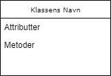
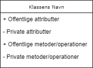
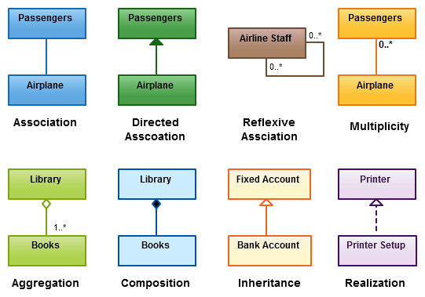

# 12. Softwarearkitektur
Systemer har det med tiden at udvikle sig i omfang og kompleksitet. Tag eksempelvis fysikmotoren, Unreal Engine, der vurderes at fylde et par millioner linjers kode, eller styresystemet, Android, som i dag vurderes at være oppe på 13-15 millioner linjers kode. Begge systemer har hundreder eller tusinder af udviklere bag. For at skabe struktur og systematik samt et fællessprog til at beskrive systemet overordnede rammer, er der brug for at inddrage softwarearkitektur. 

Softwarearkitektur definerer en grundlæggende organisering af et system og dets opførsel herunder hvordan de enkelte komponenter i systemet er samlet samt deres forhold til hinanden og kommunikationen mellem dem.

Softwarearkitektur er et slags "blueprint" for hvorledes systemet er opbygget. 
Den danner derudover udviklingsgrundlaget for programmørerne, testerne, designerne osv, så de ved hvad der skal laves hvornår og i overordnet termer hvordan.  
Samtidig inddrager og afbalancerer den projektets forskellige aktørers behov og ønsker samt hvorledes holdet bag udviklingen organiseres.

Det er med andre ord en ekstremt vigtig del i udviklingen af større og mere komplekse systemer. 

I det følgende gennemgår vi en række forskellige modeller til at konceptualisere og visualisere systemarkitektur. Det giver et bedre grundlag til at forstå hvorledes et system bør opbygges og belyser noget af den tavse viden og kompleksitet, som ligger gemt i systemer af en vis størrelse.

## Master-slave eller klient-server arkitektur - n-tier model

## Tre-lags-arkitektur
Tre-lags-arkitektur er en ret simpel struktur, der inddeler et system i tre lag: 
- Et præsentationslag hvis primære opgave at give brugeren af programmet en forståelig og tilgængelig grænseflade, som programmet er opbygget af.
- Et applikationslag, der står for at koordinere og håndtere brugerens interaktion i præsentationslaget med det underliggende datalag. 
- Et datalag hvor data knyttet til systemet er gemt og dets opgave er at bistå applikationslaget i at sende relevante data og information. 

Præsentationslaget kommunikerer med datalaget igennem applikationslaget og aldrig direkte. Herved separeres programlogik fra data og brugergrænseflade. Skal der ændres i nogle af lagene kan det i højere grad gøres uafhængig af de andre lag.
Tre-lags-arkitektur kan bruges med stort set alle tænkelige systemer, som en grundlæggende arkitektur. Eksempelvis et website, hvor man klikker på en knap, der så kalder noget kode i applikationslaget, som henter nogle data frem, der så sendes tilbage til brugergrænsefladen og vises på sitet.

## UML-diagrammer
UML står for Unified Modelling Language og er et diagramsprog til modellering af ens systemer. 
Det giver en fælles forståelsesramme og sprog til at kommunikere funktionalitet og arkitektur ud på tværs af teknologi og sprog. 

UML omfatter mange forskellige diagramtyper og man kunne skrive lange bøger om UMLs forskellige strukturer. I det følgende vil vi introducere nogle klassediagrammer, som er centrale i forhold til at visualisere og illustrere objektorienteret arkitekturer. Det skal understreges, at UML er ekstremt omfattende og man kunne fylde flere bøger alene om UML, men her berøres kun hvad der er essentielt i forhold modellering af klasser og deres overordnede relationer til hinanden.

### Klassediagrammer
Et klassediagram kan betragtes som en visuel repræsentant for et objekt. Man tegner et rektangel med 3 under-inddelinger bestående af:
-Navn: Klassenavnet
-Attributter: De feltvariable som er knyttet til klassen. 
-Metoder: De operationer/funktioner som er implementeret i klassen. Typisk opererere de på attributterne. 
Herunder et eksempel på et generisk klassediagram:

Modifikatorer som prefix for attributter og operationer indikerer synligheden af disse. F.eks. betegner et "+", at metoderne eller attributterne er offentlige. Dvs. tilgængelig for andre klasser og "-" betegner at klassen er privat. Man kan også indikerer med en hashtag, at attributten er beskyttet/protected. Dvs. kun tilgængelig for  børn af den definerende klasse.

Herunder et eksempel på et klassediagram hvor det er illustreret hvordan man signalere synligheden af attributter og metoder:

Generelt kan det variere hvor mange detaljer man ønsker at give sine klassediagrammer. Man kan typisk skelne mellem tre niveauer:

- Konceptuelt niveau hvor kun navnet på klassen angives
- Specifikationsniveau hvor klassens navn, metoder og attributter samt deres tilgængelige er inkluderet
- Implementeringsniveau hvor man også angiver typerne på attributterne og typer til parametre for de angivne metoder/operationer. Man sætter et ":" hvor typen indikeres. 
  
Det afhænger bl.a. af målgruppen hvilket niveau af detaljeringsgrad man vælger, men også hvor omfangsrigt projektet er. 

Klassediagrammer kan sammensættes og man kan med forskellige relationer illustrere hvorledes de er forbundet. 
Herunder et eksempel:

Som det bemærkes kan et klasser have forskellige relationer til hinanden. 

Herunder en oversigt over nogle af vigtigste mulige relationer man kan sætte mellem klasser. Vi vælger at bruge de engelske betegnelser, så det er nemmere at slå op. For en fuldstændig oversigt bedes man konfererere med referencemanualen til UML.

### Tilstandsdiagrammer
Tilstandsdiagrammer beskriver forskellige tilstande, som programmet kan være i og hvordan man bevæger sig fra en tilstand til en anden. Herunder et eksempel på et tilstandsdigram:

Herunder nogle eksempler på mulige relationer i et tilstandsdiagram.

### Use-case-diagrammer
Et use case-diagram illustrerer på et overordnet niveau forholdet mellem forskellige brugsscenarier, aktører/ og systemer. De fortæller ikke noget om rækkefølgen som funktioner/sekvenser udføres i.
Use-case-diagram kan illustrere hvorledes bruger og system interagerer med hinanden, definere og organisere funktionelle krav i systemet samt angive konteksten og kravene til systemet

Use cases er repræsenteret med en mærket oval form. Pindefigurer repræsenterer aktører i processen, og aktørens deltagelse i systemet modelleres med en linje mellem aktør og use case. For at skildre systemgrænsen skal du tegne en boks rundt om selve use casen.

Herunder et eksempel på et use-case-diagram:

### Sekvensdiagrammer

## C4-model
En mere moderne og forenklet tilgang til  beskrivelse og visualisering af en  softwarearkitektur på er ved brug af den såkaldte C4-model, som har fokus på abstraktioner først. Man kan tænke på C4 lidt som at læse et kort over et land. Vi starter med placere landet på verdenskortet. Dernæst zoomer vi ind på landet og kigger på de enkelte regioner og byer. Vi kan zoome mere og mere ind til vi kommer til det område, som vi befinder os i. Vi navigerer med andre ord ofte et ukendt sted ved at orientere os ud fra bestemte steder og lidt på samme måde fungerer det når vi skal forholde os til komplekse softwaresystemer.

C4-modellen bygger ovenpå 4+1-arkitekturen og UML. Den består, som navnet antyder, af fire lag:
-Context: Diagram der giver et start sted for systemets sigte og hvordan det passer ind i verdenen omkring det.
- Container: Her zoomer vi mere ind på de konkrete byggeblokke i systemet og hvordan de spiller sammen. 
- Component: På dette niveau zoomes endnu længere ind på hver af de enkelte byggeblokke i containerniveauet og illustrerer meget detaljeret hvorledes hver af disse er bygget op. 
- Code: Til sidst zoom helt ind og vi rammer det egentlig kodelag, som typisk er repræsenteret ved UML-diagrammer i form af klassediagrammer og lignende.  

Modellen giver mulighed for at fortælle forskellige historier afhængig af målgruppen og deres tekniske indsigt. 

Herunder eksempler på hver af de fire diagrammer for et konkret system. 

Det bemærkes, at diagrammerne består af:

- En person som repræsenterer en bruger af systemet 
- En container der repræsenterer en system/program eller en database. Den skal køre for at det samlet system kører
- Et component/komponent som er en samling af beslægtet og veldefineret funktionalitet, som kan kaldes igennem en veldefineret grænseflade. Det kunne eksempelvis være et sæt af beslægtede klasser.

## Øvelser

1. Konstruer en trelagsmodel for et brætspil. Beskriv i overordnede termer hvad de tre lag dækker over. 
2. Konstruer en trelagsmodel for en app, der skal kunne tage billeder og gemme det i skyen.
3. Lav et klassediagram for et DyrePatient til at håndtere dyr i et dyrehospital. Identificer mindst 3 attributter og 3 metoder, som kunne være relevante at inddrage i en sådan klasse. 
4. Konstruer nu børneklasser som udvider den oprindelig klasse, der repræsenterer fordi dyrearter. Det kan eksempelvis være konkrete dyr men også dyr eller arter eller hvorvidt de kan flyve, svømme eller være på land. Kategoriseringen er op til dig. Identificer mindst 3 attributter og 3 metoder, som kunne være relevante at inddrage i disse klasser, som adskiller sig for de andre. 
5. I det følgende ønske et design for en online bogbutik. Overvej relevante klasser herunder metoder og attributter samt deres relationer til hinanden. Visualiser disse ved brug af klassediagrammer. 
6. Lav klassediagramer over et system, som skal håndtere elever, klasser, lærere, administration/IT og klasselokaler. Systemet skal håndtere karakterer, skema, timer m.m.
7. Lav klassediagrammer over et computerspil (eksisterende eller fiktivt)
8. Konstruer de tre øverste lag i C4-modellen over en online pizzabutik kaldet MustEat, der skal understøtte muligheden for at kunder kan bestille pizzaer fra en menu over nettet.
9) Konstruer de tre øverste lag i C4-modellen for NetFix, som skal være en streamingkanal. 
10) Konstruer alle fire lag i en C4-model herunder relevante klassediagrammer i kodelaget til en app, der skal facilitere, at man kan sende penge til hinanden og betale regninger
11) Konstruer alle fire lag i en C4-model herunder relevante klassediagrammer i kodelaget til et nyt social medie.