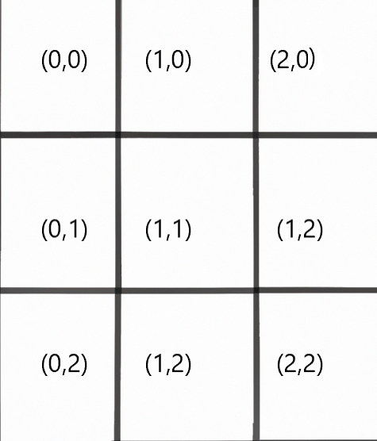

# 16. Computationel tænkning og designmønstre (ikke skrevet endnu)
 
Computationel (eller datalogisk) tænkning dækker over en række praksisser og færdigheder, der regelmæssigt benyttes, når man eksempelvis løser komplekse problemer indenfor programmering, men som desuden er essentielle for at tilegne sig viden indenfor det man kunne kalde den digitale eller computationelle verden. Det er essentielle færdigheder i forhold til at facilitere mulig kommunikation mellem menneske og maskine. 

Designmønstre betoner kodenære løsninger på problemer, der ofte opstår indenfor design og udvikling af software. Man kan betragte dem som en form for kodeskabeloner, der kan tilpasses til langt de fleste kontekster.

Fælles for begreberne "computationel tænkning" og "designmønstre" er, at de handler om at beskrive og formalisere den måde man arbejder på, når man løser problemer indenfor programmering.
I næste afsnit gives en mere detaljeret gennemgang af nogle af de vigtigste principper, der knytter sig til computationel tænkning. Herefter et afsnit om nogle af de mest anvendte designmønstre.

## Computationel tænkning
Computationel tænkning er et paraplybegreb, som dækker over en række færdigheder og metoder man typisk gør brug af i arbejdet med at udvikle løsninger på problemer indenfor programmering og datalogi.  

For forskere og udviklere såsom dataloger og programmører giver brugen af computationel tænkning mulighed for bedre at forstå hvordan systemer funger og skabe nye computatinelle modeller og algoritmer. 

For studerende er computationel tænkning et effektivt  værktøj til at hjælpe med udvikle strategier i forhold til at løse diverse problemer. 
Et oplagt eksempel på anvendelse computationel tænkning er i konstruktionen af de algoritmer, som implementeres, når man udvikler et nyt system. Men computationel tænkning bruges i den grad også udenfor programmering. Eksempelvis når man skal bage en kage eller når man skal instrueres i at bygge et fysisk produkt såsom et legetøj fra Lego eller et møbel fra Ikea.

Netop fordi den digitaliseret verden bliver stadig mere nærværende har der i de senere år været et stadig stigende fokus på at træne og udvikle computationel tænkning fra grundskolen til gymnasiet og det gælder i øvrigt på tværs af lande. 
Det hænger desuden sammen med, at stort set alle fag og aspekter af samfundet har fået øjenene op for, at den computationelle tankegang er relevant og nødvendig i mange sammenhænge i forhold til at kommunikere med computeren og løse problemer. 

Herunder gennemgår vi fire af de vigtigste principper indenfor computationel tænkning kaldet dekomposition, abstraktion, mønstergenkendelse og algoritme design. Det er i den sammenhæng vigtigt at understrege, at computationel tænkning ikke kan reduceres til disse fire principper men dækker over et langt mere omfattende teori og begrebsapparat, men at disse principper er centrale for forståelsen og anvendelsen af computationel tænkning indenfor programmering.

I gennemgangen af de fire principper tages udgangspunkt i udviklingen af et simpelt kryds og bolle spil. 

### Dekomposition
Dekomposition minder ret meget om princippet "del og hersk", men der er dog forskelle. Førstnævnte har rod i problemløsning, hvor det handler om at løse et problem i mindre dele, som både mennesket og computeren har nemmere ved at forstå og samtidig finde en løsning på. Dekomposition er mao. en ret kodenær strategi, som gør det muligt at indele koden i mindre dele og efterfølgende gør det nemmere at teste og fejlrette. Del og hersk har rødder i algoritmikken, som en teknik til at dele problemer ind i mindre similære problemer indtil de kan løses, hvilket rekursive algoritmer er et godt eksempel på.  

I forhold til at bruge dekomposition i udviklinge af kryds og bolle kunne man eksempelvis oprette funktioner, der har forskellige opgaver. Det kunne eksempelvis være at tage imod input fra brugeren, tjekke brættet for mulige vinderkombinationer eller tegne brættet. 

### Abstraktion
Abstraktion eller generalisering handler om at kigge på sit problem eller domæne fra et helikopterperspektiv. Når vi kigger på tingene fra en helikopter fokuserer vi på de vigtigste informationer og elementer i det eller de problemer, som vi forsøger at løse, og vi ignorer nogle af de unødige detaljer. Dermed ikke sagt at detaljen på et tidspunkt ikke er vigtig, men abstraktion sker typisk i designfasen af ens problem. 

I forhold til kryds og bolle kunne man eksempelvis betragte de to mulige spillere `X` og `O`. Selvom de på papiret ser forskellige ud så har de også meget til fælles. De skal begge tegnes i en celle, tre på stribe giver sejr osv. Man kan med andre ord forestille sig, at man i praksis koder kun en enkelt spiller og blot ændre måden denne spiller tegnes på ud fra hvis tur det er. På denne måde bliver logikken adskilt fra den grafiske repræsentationen, hvilket muliggør, at man kan ændre de to dele for sig uden at skulle ændre på den anden. 

Abstraktion kan også bruges i forhold til at gøre sig overvejelser omkring repræsentation af brættet i den faktiske kode. I praksis kunne de 3*3 felter repræsenteres af hver deres variable, men i den sammenhæng indses det ret hurtigt, at det nok er bedre at bruge et array eller en liste.  

```javascript
function createBoard() {
  let board = [];
  for (let i = 0; i < 9; i++) {
    board[i] = "-";
  }
  return board;
}
```
Her initialiseres de ni celler med en bindestreg blot for at illustrere, at cellerne er tomme. 

En anden mere lidt mere skalerbar repræsentation af brættet ville være ved brug af et to-dimensionelt array. Herunder en skitsering af funktion til at konstruere brættets repræsentation: 

```javascript
function createBoard(rows,cols) {
  let board = [];
  for (let r = 0; r < rows; r++) {
    board[r] = [];
    for (let c = 0; c < cols; c++) {
      board[r][c] = "";
    }
  }
  return board;
}
```
Funktionen tager to parametre svarende til antallet af rækker og kolonner. Igen et eksempel på hvorledes abstraktion skaber langt mere elegant kode, hvis man senere ønsker at generalisere brættet til vilkårlige størrelser. 

Endelig kunne man også forestille sig at indlejre selve spillet i en klasse, der indeholder metoder til at håndtere spillets tilstand, om der er en vinder eller visualiseringen af brættet. 

### Mønstergenkendelse
Man kunne bruge mønstergenkendelse til at identificere de mulige vinderkombinationer enten ved brug af en kombination af strenge eller ved brug af løkker/betinget udførsel til at tjekke om brættet opfylder en vinderkombination. 

Hvis brættet var repræsenteret ved et en-dimensionelt array, så ville vinderkombinationerne se således ud, hvor tallene refererer til index i arrayet og plus refererer til en sammenkædning af de enkelte felter:

* Første række: 0+1+2
* Anden række: 3+4+5
* Tredje række: 6+7+8
* Første kolonne: 0+3+6
* Anden koloonne: 1+4+7
* Tredje kolonne: 2+5+8
* Første diagonal: 0+4+8
* Anden diagonal: 2+4+6


Hvis repræsentationen af brættet er et to-dimensionelt array jf. figuren herunder, vil vindermønstrene bestå af en sammenkædning af følgende celler:

* Første række: (0,0)+(1,0)+(2,0)
* Anden række: (0,1)+(1,1)+(1,2)
* Tredje række: (0,2)+(1,2)+(2,2)  
* Første kolonne: (0,0)+(0,1)+(0,2)
* Anden koloonne: (1,0)+(1,1)+(1,2)
* Tredje kolonne: (2,0)+(1,2)+(2,2)
* Første diagonal: (0,0)+(1,1)+(2,2) 
* Anden diagonal: (2,0)+(1,1)+(0,2)



Da brættet er relativt småt er det næsten nemmere at finde disse mønstre ved brug af sammensatte strenge. Gør vi brættet større eller udvider det til fire-på-stribe kunne man passende benytte en løkkekonstruktion til at indhente de givne mønstre. 

## Algoritme design
I denne fase formuleres en skridt for skridt procedure eller algoritme, som løser den konkrete opgave såsom at tjekke hvorvidt en spiller har vundet. Herunder en funktion, der tjekker for nogle af de mulige vinderkombinationer fundet tidligere. 

Herunder en version der tjekker for vinderkombinationer, hvor brættet er repræsenteret ved et 1-dimensionelt array:

```javascript
function checkWinnerCombo(board){
  let winnerCombos = []
  winnerCombos.push(board[0]+board[1]+board[2])
  winnerCombos.push(board[3]+board[4]+board[5])
  winnerCombos.push(board[6]+board[7]+board[8])
  winnerCombos.push(board[0]+board[3]+board[6])
  winnerCombos.push(board[1]+board[4]+board[7])
  winnerCombos.push(board[2]+board[5]+board[8])
  winnerCombos.push(board[0]+board[4]+board[8])
  winnerCombos.push(board[2]+board[4]+board[6])
  if(winnerCombos.contain("xxx")){
    return "X"
  }
  if (winnerCombos.contain("ooo")){
    return "O"
  }
  return "-"
}
```
Alle de mulige vinderkombinationer tilføjes som streng-elementer i en liste. Til sidst tjekkes om nogle af disse indeholder tre ens symboler ("x" hhv "o"). 

Herunder en tilsvarende funktion for det 2-dimensionelle bræt:

```javascript
function checkWinnerCombo(board){
  let winnerCombos = [board[0][1]+board[1][0]+board[2][0],
                      board[1][3]+board[1][4]+board[1][5],
                      board[2][6]+board[2][7]+board[2][8]]
  if(winnerCombos.contain("xxx")){
    return "X"
  }
  if (winnerCombos.contain("ooo")){
    return "O"
  }
  return "-"
}
```

Arrayet `winnerCombos`samler strenge af krydser og boller for at identficere om der findes en celle med enten "xxx" eller "ooo". Funktionen returner enten "X","O" eller "-" afhængig af om der er en vinder og i såfald hvem.

Et andet eksempel på algoritme design ved kryds og bolle er at udvide spillet med en simpel AI. 
Da der er et begrænset antal mulige valg kan man diskutere hvor avanceret implementering af en AI man ønsker. Men en mulighed kunne være at bruge en såkaldt `minmax` algoritme. Som udgangspunkt forventer algoritmen altid, at modstanderen vælger det bedst mulige træk, så den vælger ud fra det hvad det bedst mulige træk er for den.  Groft skitseret vil den følge følgende trin:
1. Evaluer brættets tilstand og tildel point til hver tom celle på brættet
2. Generer en liste af mulige træk, som kan tages ud fra spillets nuværende tilstand 
3. For hvert træk simuleres modstanderens mulige svar
4. Der tildeles en score i forhold til den resulterende tilstand af brættet
5. AI vælger det træk der resulterer i den højeste score for den selv. 


## Designmønstre
Har man kodet længe nok oplever man nok, at man løber ind i mange af de samme problemer og udfordringer uafhængig af hvilket system man udvikler, hvilken kontekst/domæne man arbejder indenfor eller hvilket sprog man koder i. Kigges eksempelvis på mobile webapplikationer er der megen af den samme funktionalitet og mange af de samme problemer uafhængig af om der udvikles et nyt socialt medie, en webshop eller lignende. 
Designmønstre (kaldet "design patterns" på engelsk) er et forsøg på at komme disse typiske problemer til livs ved at tilbyde generiske løsninger og generelle koncepter, som kan sættes i spil. Modsat algoritmer, der ligesom en madopskrift typisk definerer et meget præcist sæt af instruktioner, som løser en konkret opgave, så er designmønstre mere generiske konceptuelle skabeloner på løsninger, der kan justeres til den konkrete kontekst og system.

I det følgende gives først et overblik over de forskellige typer af designmønstre og gennemgår vi i flere detaljer med konkrete kodeeksempler, en række af de vigtigste designmønstre.

### Tre forskellige typer designmønstre
Designmønstre kan inddeles i fire overordnede typer:
- Konstruktionsmønstre (på engelsk: "creational patterns"): Beskriver forskellige måder eller mekanismer til at konstruere eller kreaere objekter på. 
- Strukturelle mønstre (på engelsk: "structural patterns"): Beskriver hvorledes objekter kan samles i større strukturer, som stadig er fleksibel, skalerbar og effektiv.
- Adfærdsmønstre (på engelsk "behavioral patterns"): Beskriver hvorledes ansvar fordeles mellem forskellige objekter og hvorledes algoritmer kan integreres.

### Konstruktionsmønstre
Herunder gennemgås kort eksempler på tre af de mest typiske konstruktionsmønstre, fabriksmønsteret, byggemønsteret og prototypemønsteret. 

#### Fabrik mønsteret ("Factory design pattern")
Factory design mønsteret giver mulighed for at konstruere objekter uden at præcisere hvilken klasse de er instantieret fra. I stedet konstrueres en fabrik, som har ansvaret for at oprette objekterne.

Et eksempel i p5.js kan være en fabrik, der opretter forskellige former for trekanter. 
Fabrikken kan have en metode, der tager en parameter som indikerer typen af trekanten. Eksempelvis kunne man forestille sig en med runde hjørner, stump eller spids trekant. Fabrikken returnerer derfor et objekt af den ønskede type.

```javascript
class TriangleFactory {
  create(type) {
    if (type === 'normal') {
      return new NormalTriangle(); // normal trekant
    } else if (type === 'Obtuse') {
      return new ObtuseTriangle(); // stump trekant
    } else if (type === 'Pointed') {
      return new PointedTriangle(); // spids trekant
    }
  }
}

const factory = new TriangleFactory();
const triangle1 = factory.create('normal');
const triangle2 = factory.create('obtuse');
const triangle3 = factory.create('pointed');
triangle1.draw()
triangle2.draw()
triangle3.draw()
```

Metoden `create()` tager en parameter på baggrund heraf returneres en instans af den tilsvarende klasse.

De enkelte klasser, der repræsenterer de tre typer trekanter skal stadig konstrueres. Typisk kunne det gøres ved brug af nedarvning, hvor de tre trekantklasser arver fra en fælles forældreklasse:

```javascript
class Triangle {
  //...
  draw() {
    console.log("Drawing from Triangle")
  }

}
class NormalTriangle extends Triangle {
  //...
  draw() {
    console.log("Drawing from NormalTriangle")
  }
}
//...
```

Mønsteret er relevant at bruge, når vi har en forældreklasse med flere børn, og vi ønsker at returnere en af børneklasserne. Ved at bruge mønsteret fratages ansvaret for instansieringen af ​​en klasse og tildeles i stedet fabriksklassen. Herved centraliseres koden og gør det nemmere at ændre og justere hvis eksempelvis man udvider med flere børneklasser senere. 


#### Byggemønsteret ("Builder pattern")
Builder design pattern er en måde at opbygge komplekse objekter ved at adskille objektets konstruktion fra dens representation. Det gør det nemmere at skifte mellem forskellige måder at opbygge et objekt på, uden at ændre selve objektet. 
Mønsteren kan bruges til at bygge mere komplekse objekter ved at give brugeren mulighed for at specificere hvad der er knyttet til klassen fremfor en kompleks konstruktør i klassen, som tager en lang række parametre, kan man i stedet lade brugeren vælge og tilføje hvad der skal være inkluderet i det endelige objekt.

Et eksempel i p5.js kan være en klasse, der repræsenterer en skitse, der består af flere figurer. I stedet for at have en konstruktør, der tager en række parametre for at oprette skitsen, kan man bruge en builder-klasse til at bygge skitsen op. 

```javascript
class SceneBuilder {
  constructor() {
    this.scene = [];
  }

  addCircle(x, y, r) {
    this.scene.push(new Circle(x, y, r));
  }

  addTriangle(x1,y1,x2,y2,x3,y3)
  {
    this.scene.push(new triangle(x1,y1,x2,y2,x3,y3))
  }

  addRectangle(x, y, w, h) {
    this.scene.push(new Rectangle(x, y, w, h));
  }

  getSketch() {
    return this.scene;
  }
}

const builder = new SceneBuilder();
builder.addCircle(10, 30, 55);
builder.addTriangle(5, 5, 60,60,700,700);
builder.addRectangle(30, 30, 40, 40);
const mySketch = builder.getSketch();
```
I eksemplet ovenfor tilføjes en cirkel, en trekant og et rektangel til en scene, der reelt bare er et tomt array. 
Ved at bruge builder-mønsteret kan man nemt tilføje eller fjerne figurer i scenen, uden at skulle ændre i selve scenen. Ligesom man også nemt kan skifte mellem forskellige måder at opbygge scenen på ved at have flere forskellige scenebyggere.

#### Prototypemønsteret
Prototypemønsteret bruges til at oprette nye objekter ved at klone eksisterende objekter i stedet for at oprette dem fra bunden. Det gør det nemmere at oprette flere objekter, som minder meget om hinanden men stadig er unikke. 

Nedenfor konstrueres en prototype-klasse kaldet `Circle`, som klones ved at kalde `Object.create`. Dernæst ændres værdierne for klonen. 

```javascript
class Circle {
  constructor(x, y, r) {
    this.x = x;
    this.y = y;
    this.r = r;
  }
  draw() {
    ellipse(this.x, this.y, this.r * 2, this.r * 2);
  }
}

function setup() {
  const prototypeCircle = new Circle(50, 50, 30);
  const newCircle = Object.create(prototypeCircle);
  newCircle.x = 100;
  newCircle.y = 100;
  prototypeCircle.draw();
  newCircle.draw();
}
```

#### Singletonmønsteret
Singleton pattern er en design pattern, der sørger for, at der kun kan oprettes én instans af en klasse i koden, hvilket muliggør at dele objekter mellem forskellige dele af programmet, da man altid ved, at der kun er én instans af objektet.

I p5.js kan man bruge Singleton pattern til at sikre, at der kun er én instans af en klasse, der styrer adgangen til en bestemt ressource. Det kunne eksempelvis være en klasse `Config`, som opbevarede nogle data, der beskrev konfigurationen af et system. Dvs. nogle globale værdier, som skal kunnes ændres og tilgås fra forskellige steder i programmet.

Herunder er et eksempel:

```javascript
class Config {
  constructor() {
    if (!Config.instance) { //her tjekkes hvorvidt klassen allerede er instantieret
      this.data = [];
      Config.instance = this;
    }
    return Config.instance;
  }

  addData(item) {
    this.data.push(item);
  }

  getData() {
    return this.data;
  }
}

const config1 = new config();
const config2 = new config();
console.log(config1 === config2); // returner sand

config1.addData("Et tal");
console.log(config2.getData()); // returner ["Et tal"]
```

Ved at tjekke i instanstieringen af klassen hvorvidt klassen allerede er oprettet. Hvis det er tilfældes returnes den eksisterende instans og ellers oprettes den for første gang. Således kan forskellige instanser af klassen arbejde på de samme data. 

### Strukturelle mønstre
Herunder gennemgås tre af de mest anvendte strukturelle mønstre, adapter-mønsteret, facade-mønsteret og komposit-mønsteret.

#### Adapter-mønsteret
Adapter-mønsteret er et designmønster, der gør det muligt for to funktioner/klasser/biblioteker med forskellige grænseflader at arbejde sammen ved at tilpasse den ene grænseflade til den anden. I p5.js bruges Adapter-mønsteret ofte til at tilpasse JavaScript-objekter eller biblioteker til at kommunikere med biblioteket p5.

Herunder et eksempel. Fra P5 ved vi, at der eksisterer en metode til at tegne en cirkel, der tager tre parametre: x,y og radius. 

Vi kunne forestille os, at vi ville gøre brug af den i et andet program lave en grænseflade til denne metode, så vi kan gøre brug af den heri. Det kunne eksempelvis gøres ved at lave en funktion, hvor vi sikrer, at cirklen stadig får radius og ikke diameteren. 

```javascript
function DrawCircleAdapter(x,y,d)
{
    circle(x,y,d/2)
}
```

#### Facade-mønsteret
Facade-mønsteret giver en simpel grænseflade til en kompleks system. På den måde tilbydes et abstraktionslag mellem klienten og det komplekse system, hvilket gør det nemmere at bruge og forstå. I p5.js kan facade-mønsteret bruges til at skjule kompleksiteten i at bruge flere forskellige biblioteker eller funktioner i en enkel grænseflade. På denne måde kan man f.eks. opbygge et komplekst program med mange forskellige funktioner og stadig gøre det nemt at bruge og forstå for en bruger. 

Herunder et eksempel:

```javascript
class P5SketchFacade {
  constructor() {
    this.graphics = new p5(); // her instantieres et p5 objekt, som normalt håndtere scenen
    this.sound = new p5.sound(); //her instantieres lyd til p5
  }
  drawCircle(x, y, r) {
    this.graphics.ellipse(x, y, r);
  }
  createButton(lblName, x, y) {
    this.dom.createButton(lblName).position(x, y);
  }
  playSound(file) {
    this.sound.play(file);
  }

}
```

Herunder bruges facade-mønsteret i praksis:
```javascript
let sketch = new P5SketchFacade();
sketch.createButton("Spil", 50, 40);
sketch.playSound("lyd.mp3");
sketch.drawCircle(100, 100, 50);
```

#### Komposit-mønsteret
Komposit-mønsteret muliggør at arbejde med en samling af objekter på en ensartet måde. Samlingen af objekter kan behandles som var det et enkelt objekt. Det giver mere overskuelig og elegant kode, og nemmere at organisere og manipulere komplekse hierarkier af objekter. 

Et godt eksempel i p5 kunne være at opbygge mere komplekse animationer eller scener ved at sammensætte simple objekter til mere komplekse objekter, som knyttes til en scene. Herunder et eksempel hvor vi igen kan tilføje forskellige geometriske figurer til scenen.

```javascript
class Scene {
    constructor() {
        this.shapes = [];
    }
    add(shape) {
        this.shapes.push(shape);
    }
    remove(shape) {
        let index = this.shapes.indexOf(shape);
        if(index !== -1) {
            this.shapes.splice(index, 1);
        }
    }
    draw() {
        for (let shape of this.shapes) {
            shape.draw();
        }
    }
}
```
Mønsteret minder om byggemønsteret men adskiller sig ved, at vi abstraherer fra hvilken slags geometrisk form, som vi ønsker at tilføje til scenen. 

Eksempelvis kunne vi bruge mønsteret på at tilføje forskellige figurer på en elegant måde og efterfølgende tegne den:

```javascript
let myScene = new Scene();
let square = new Square(100, 100, 30);
let circle = new Circle(200, 300, 40);
let triangle = new Triangle(300, 490, 70);
myScene.add(square);
myScene.add(circle);
myScene.add(triangle);
myScene.draw()
```


### Adfærdsmønstre
Herunder gennemgås tre af de vigste adfærdsmønstre, ansvarskæden-mønsteret, kommando-mønsteret og iterator-mønsteret. 

#### Ansvarskæde-mønsteret ("Chain of responsibility")
Ansvarskæde muliggør at sende et objekt gennem en kæde af objekter til det når et objekt, der kan operere på det. Det giver en fleksibel måde at håndtere begivenheder eller anmodninger i et system. Eksempelvis kunne det være relevant ved håndteringen forskellige typer input fra brugeren:

```javascript
class ClickHandler {
    constructor() {
        this.next = null;
    }
    handleClick(x, y) {
        if (this.next) {
            this.next.handleClick(x, y);
        }
    }
}
class CircleHandler extends ClickHandler {
    handleClick(x, y) {
        if (insideCircle(x, y)) {
            console.log("Vi har klikket på en cirkel");
        } else {
            super.handleClick(x, y);
        }
    }
}
class SquareHandler extends ClickHandler {
    handleClick(x, y) {
        if (insideSquare(x, y)) {
            console.log("Vi har klikket på et kvadrat");
        } else {
            super.handleClick(x, y);
        }
    }
}
```
Her tjekker metoderne `insideCircle` og `insideSquare` hvorvidt vi har klikket indenfor en cirkel hhv. et kvadrat. 
Metoderne er ikke implementeret, hvilket overlades til læseren.  De skal havde adgang til hvor cirklerne og kvadraterne er placeret. Her kunne man eksempelvis gør brug af eksempelvis singletonmønsteret. 

Herunder anvendes mønsteret til at håndtere forskellige kliks:
```javascript
let circle = new CircleHandler();
let square = new SquareHandler();
circle.next = square;

function mouseClicked() {
    circle.handleClick(mouseX, mouseY);
}
```

#### Kommandomønsteret
Command-mønsteret er et designmønster, der adskiller en anmodning om at udføre en handling fra selve handlingen. Det giver en fleksibel måde at håndtere handlinger eller kommandoer i et system. I p5.js kan kommandomønsteret bruges til at håndtere input eller interaktioner fra brugeren.

For eksempel, hvis man ønsker at opbygge en interaktiv scene med flere forskellige interaktionsmuligheder, kan man oprette et Command-objekt for hver handling, der skal udføres.

Man kunne forestille sig, at der bygges en scene hvor brugeren kan skifte baggrundsfarve ved at trykke på en knap.

I din forbindelse oprettes en Command-klasse med en eksekveringsmetode kaldet `execute()`. 
Ved at skifte baggrundsfarve kan repræsenteres som en ny instans af Command-klassen med sin specifikke implementering af execute()-metoden.

```javascript
class Command {
    constructor() {
        this.execute = function(){};
    }
}

class changeBGColor extends Command {
    constructor(color) {
        super();
        this.color = color;
        this.execute = function() {
            background(color);
        };
    }
}
```

I scenen kan nu oprettes en ny instans af `changeBGColor`, når brugeren trykker på knappen, og kalder `execute()`:
```javascript
function setup() {
    let button = createButton("Ændre baggrundsfarven");
    button.mousePressed(changeBackground);
}
function changeBackground() {
    let cmd = new changeBGColor("yellow");
    cmd.execute();
}
```

## Øvelser
1. Udvælg et relevant problem og prøv at anvende computationel tænkning til at løse det. Beskriv løsningen ud fra hvorledes du anvender de fire principper, abstraktion, dekomposition, mønstergenkendelse og algoritme design. 
2. Færdiggør implementationen af kryds og bolle spillet som beskrevet i starten af kapitlet. Udvid gerne med en simpel AI-modstander. 
3. Anvend computationel tænkning til at lave et fire-på-stribe spil. Beskriv løsningen ud fra hvorledes du anvender de fire principper, abstraktion, dekomposition, mønstergenkendelse og algoritme design. Du behøver ikke at implementere den faktiske kode. Men pseudokoden skal være så kodenær, at det er let at gøre. 
4. I det følgende skal udvikles fabriksmønstre til at oprette forskellige typer figurer på scenen og forskellige animationer (såsom hoppende bolde eller svævende trekanter). 
5. Overvej forskellige eksempler hvor det kan være relevant at bruge fabriksmønsteret. 
6. Implementer et byggemønster, der kan konstruere forskellige typer af to-dimensionelle huse set fra siden. De må gerne tegnes ud fra simple geometriske primitiver. 
7. Beskriv hvorledes byggemønsteret er brugt herunder og hvad det gør:

```javascript
  class ColorBuilder {
    constructor() {
      this.grey = 0;
    }
    
    withGrey(grey) {
      this.grey = grey;
      return this;
    }
    
    build() {
      return color(this.grey);
    }
  }
```
8. Udvid forrige opgave ved brug af byggemønsteret så den kan konstruere en RGB-farve. 
9. Brug Kompositmønsteret til at konstruere tegninger af forskellige typer huse ved brug af forskellige geometriske former.
10. Overvej styrker ved ansvarskædemønsteret og hvorledes det kan bruges i en selvvalgt opgave. 

## Projekt: Designmønstre i udviklingen af et spil
I det følgende skal man bruge design patterns til at designe og konstruere et læringsspil indenfor et selvvalgt fag, niveau og alderstrin. Det kunne eksempelvis være at lære folkeskoleelever om addition og subtraktion eller om en større begivenhed i historie. 
Fokus i opgaven er på hvorledes design patterns kan bruges til at implementere løsningen i praksis. 
En fremgangsmåde kunne være følgende:

1. Definer projektets formål og målgruppe: Hvem henvender spillet sig til. Hvilken målgruppe? Hvilken faglig problemstilling forsøger det at 
2. Identificer de nødvendige design mønstre: For eksempel kan der anvendes Factory Pattern til at oprette forskellige typer af spilobjekter, singletonmønster til at sikre, at der kun er én instans af et objekt, eller observationsmønster til at lade objekter lytte efter justeringer i andre objekter.
3. Programmer de valgte designmønstre. Formentlig kan det være en god ide at starte med de mest grundlæggende mønstre og inkrementelt udvide dem. 
4. Konstruer spillets grafik og mekanik herunder  tegne spilobjekter og baggrund, implementere interaktion mellem spiller og spilobjekter, og definere spillets regler og mål.
5. Teste og tilpasse spillet: Når spillet er færdigt, skal det testes og justeres for at sikre, at det fungerer som det skal. Måske er det nødvendigt at finjustere spillets balance, grafik eller lydeffekter for at skabe den ønskede spiloplevelse.

Afslutningsvis er det en god ide at reflektere over brugen af designmønstere. 

## Projekt: Computationel tænkning i udviklingen af interaktiv data visualisering 

I følgende projekt skal udvikles en applikation ved brug af computationel tænkning, der giver mulighed for interaktivt at udforske og visualisere et datasæt indenfor et bestemt emne. Eksempelvis kunne være at kigge på klimadata hvor målet er visualisere klimaforandringer over tid. En anden mulighed kunne være at kigge på data over uligheden blandt rige og fattige i verdenen og hvorledes den er vokset over tid.  
Man vælger selv et emne som er interessant. Herefter bør det overvejes hvorledes de fire kerneprincipper (abstraktion, dekompositoin, mønstergenkendelse og algoritmedesign) hver især kan inddrages i udviklingen af applikationen.  