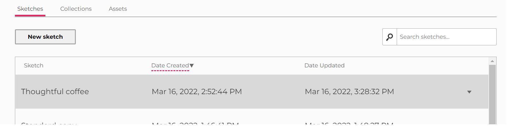
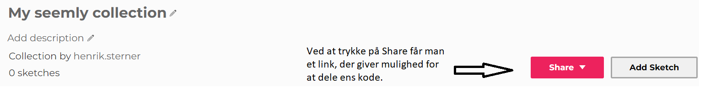
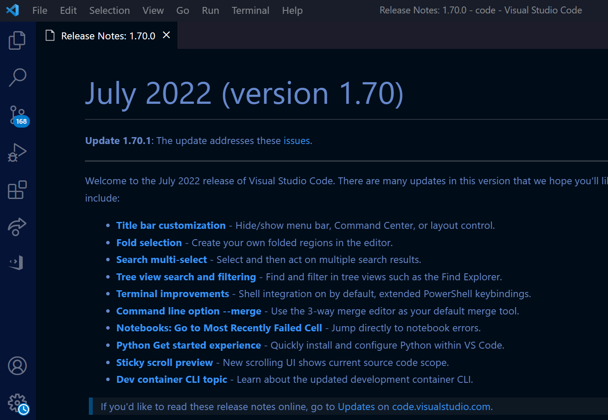
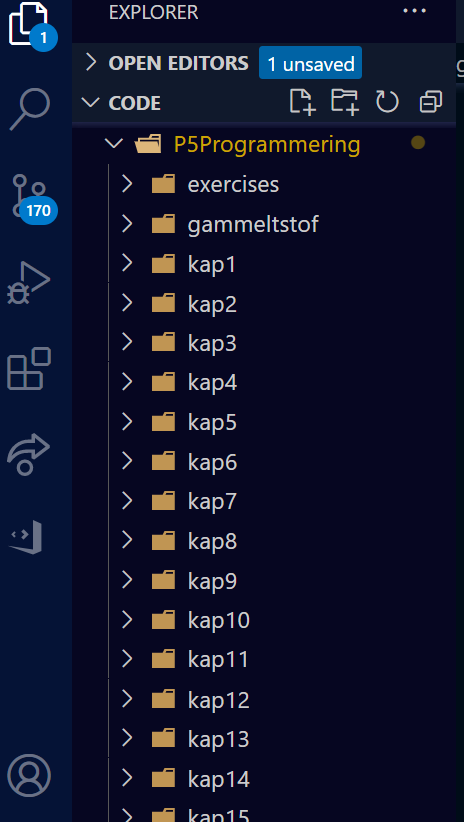
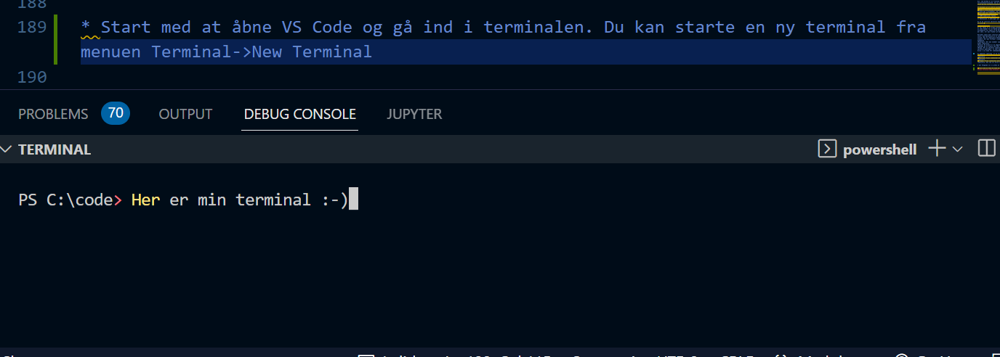
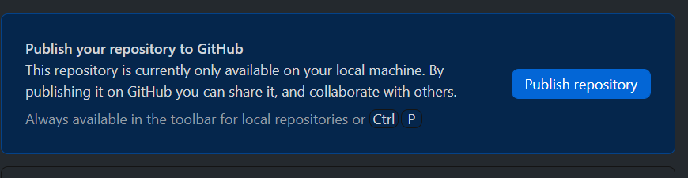
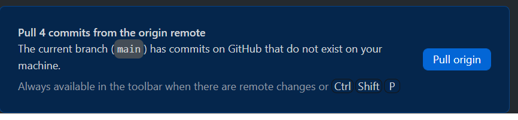

# 18. Udviklingsmiljø og versioneringskontrol
Et godt udviklingsmiljø er helt centralt, hvis man skal blive en god og produktiv programmør på sigt. Det giver bl.a. mulighed for at finde fejl hurtigere pga muligheden for debugning og syntaks highlightning (giver koden farve efter dens struktur), teste nemmere, forslag til kode og mulighed for at arbejde med andre udviklere på samme projekt. Det er essentielt at kende sit udviklingsmijø godt.
Man kan måske sammenligne det lidt med en forfatter, der måske nok kan vælge at skrive sin bog på en gammel skrivemaskine, men som med de moderne tekstbehandlingssystemer til rådighed meget nemmere kan rette fejl, slå op i synonym ordbog osv.

I det følgende vil vi gennemgå i detaljer hvorledes man 

- skriver kode via editoren på p5js.org og deler den med andre
- installere og bruger editoren VS kode
- installere og bruger versioneringssystemet Github.

Versioneringssystemer spiller en central rolle i moderne udvikling, da det giver mulighed for at arbejde sammen på projekter og i det hele taget holde styr på udviklingen af ens kode. Det gør det nemt at gå tilbage til en tidligere version af ens kode.

## Brug af editoren på p5js.org
For at starte op med at kode skal du ind på p5js.org og trykke på "Editor":<br>


Det vil kun være muligt at gemme, hvis du opretter en konto og/eller logger ind. Det kan gøres ret nemt med en gmail/github konto eller man kan oprette en konto på en anden mail. Alle filer bliver gemt i skyen. Du kan selvfølgelig hente dine programmer ned, hvis du er interesseret i det. 

Herefter kommer du ind i en menu, der ser således ud:


Til venstre ses feltet hvor du skriver koden. Til højre resultatet af din kode, hvis du har trykket "Play" på den røde knap med trekanten. 
Konsollen ses nederst i venstre hjørne. Den kan eksempelvis være god at bruge, når du f.eks. vil udskrive nogle variablers værdier for at tjekke om de rent faktisk er det du tror de er.
Du kan lave nye filer under, dele projekter og se andres projekter oppe i menuen:


Kollektioner er en mulighed for at samle filer og dele dem med andre: 





Når du ønsker at sprede din kode udover flere filer, så kan det også ret let lade sig gøre ved at gå op i hovedmenuen og trykke på "Sketch" efterfulgt af menupunktet "Add file". Her giver du filen et navn. Husk at hvis det skal være javascript kode skal den have efternavnet js til sidst. I det følgende har vi lavet en ny fil som vi har kaldt for sketch2.js. Tryk på vinklen ude til venstre for at danne dig et overblik over din kode: 


For at du kan bruge filen er det nødvendigt at inkludere den i din html kode. Vær her særligt opmærksom på rækkefølgen af de filer du inkluderer. Hvis en fil y er afhængig af en anden fil x, så bør x inkluderes før y. 


Generelt er det en god ide tidligt at lave en fornuftig filstruktur for dine projekter. Det bliver essentielt når man begynder at lave større projekter, der måske spreder sig over mange forskellige kodefiler og som inkluderer måske, både lyd, billeder og video. 
En mulig overordnet struktur kunne være noget ala følgende: 


Mapperne kan du lave op under Sketch->Add folder. 
- src rummer alle javascript filerne
- videos rummer alle videoer
- images rummer alle billeder


Ud fra hver folder kan du tilføjer nye filer eller uploade filer til mappen. 

Vær dog opmærksom på at inkludere de rigtige stier i din html fil. Her er et eksempel på hvorledes man kunne inkludere en fil kaldet sketch.js, som ligger i src:


Bemærk tilføjelsen af "src/" i linje 13.

Det afslutter vores korte gennemgang af de vigtigste funktioner i online editoren. Endelig vil vi også gøre opmærksom på, at kigger man på html koden har man måske bemærket følgende linjer i head-tag:

```javascript
<script src="https://cdnjs.cloudflare.com/ajax/libs/p5.js/1.4.1/p5.js"></script>
<script src="https://cdnjs.cloudflare.com/ajax/libs/p5.js/1.4.1/addons/p5.sound.min.js">
```

Disse linjer sørger for at inkludere p5-biblioteket. Det er alt hvad der skal til. Med mindre at du skal afspille lyd kan du faktisk også slette inklusionen af det sidste script.

## Visual Studio Code
Visual Studio Code er udviklet af Microsoft og et af de mest populære udviklingsmiljøer netop nu. 

Den er gratis, bygget på open source, og kan afvikles på stort set alle tænkelige systemer og platforme. Den har et hav af af pakker og et stort samfund af udviklere bag sig, og den lader sig i høj grad tilpasse til udviklerens behov og krav.

Til sammenligning med den fulde pakke, Visual Studio, så er Code en letvægtseditor i den forstand, at den fylder markant mindre og den afvikles langt hurtigere på de fleste systemer.

Download den nyeste stabile version af [Visual Studio Code](
https://code.visualstudio.com/) og kør den ekskverbare installationsfil. 

### Overblik over menuen 
Herunder ses hovedmenuen når man starter VS code. Bemærk først og fremmest, at systemet nok ser lidt anderledes ud hos læseren. Det skyldes bl.a. at ikke alle menupunkter er installeret ved en nyinstalleret version af miljøet. 



I venstre side ses nogle af de centrale menupunkter og dem vil vi kort dvæle ved:


Filosofien bag VS code er i høj grad, at man bør bruge tastaturet så meget som muligt fremfor at bruge musen. Det betyder, at der er en lang række genveje som er gode at kende. Illustrationen ovenfor viser nogle af de centrale genveje, som er gode at øve sig i at bruge. Man er selvfølgelig altid velkommen til at bruge musen, hvis man har glemt en genvej. 

For rigtig at komme i gang med miljøet bør man starte med at udvælge en mappe på ens computer, hvor man har tænkt sig at lægge sine projekter som undermapper. Dvs.: 

1. Opret en folder på din computer
2. Start VS Code
3. Gå ind under menuen File og vælg "Add Folder to Workspace
4. Vælg mappen som du har oprettet

Når du nu bruger stifinderen (Ctrl/Command+Shift+E), så vil du få en menu frem i venstre side, der viser dine mapper i dit workspace. 



### Installation af P5 
Til at afvikle applikationer i P5 har vi brug nogle få plugins. 

* Live Server: Giver mulighed for at afvikle en lokal webserver, som vores programmer kan køre på
* P5 Project Creator: Giver mulighed for nemt at starte et nyt projekt
* p5js Snippets: En række generiske kodestumper som automatisere en del af arbejdet med at skrive koden. 

Et andet godt plugin som kan være godt at kende er Live Share, som giver mulighed for at arbejde flere sammen på samme tid i samme dokument. 

### Starte dit første projekt 
Når disse tre plugins er installeret, så bør VS code genstartes. Herefter burde du være klar til at gå i gang. 

1. Find i menuen under View-> Command Palette eller brug genvejen Ctrl/Command+Shift+P. 
2. Nu skulle du gerne have en prompt, hvor du skriver "create p5.js project". Typisk så foreslår VS code den ønskede, når du har skrevet nogle få tegn, så du bare kan vælge den med piltasterne 
3. Herefter bliver du bedt om at lave en folder til dit projekt. Der vælger du en folder i dit workspace. Navngiv projektet så det har et sigende navn for det du vil lave. 

Når processen er færdig skulle du meget gerne i dit workspace have en filstruktur:


Når du så vil starte dit projekt, går du ind i html filen og trykker på knappen som vist i figuren:  


Du behøver kun at starte din webserver engang. Når du gemmer ændringer i din kode i VS code genstartes din P5 applikation automatisk.


## Versioneringskontrol med Github og git
Github, som egentlig bare er en grænseflade til det såkaldte git, er et versionkontrolsystem. Man kan populært sagt tænke på det som en tidsmaskine over ændringer i kodebasen. 
Fordelene ved versionskontrol er bl.a.:

* Mange udviklere kan arbejde på samme kodebase
* Kodebasen ændringshistorik gemmes
* Ældre versioner af kodebasen kan rekonstrueres

Et helt central begreb indenfor versioneringssystemer er "repository". 
Et repository kan populært sagt betragtes som en form for server, hvor man samler alle projektets filer samt hver fils revisionshistorie. På Github kan man faktisk ydermere håndtere og diskutere projektets indhold og arbejde i projektets repository. 

Man kan skelne mellem to slags versioneringssystemer: 
* Centraliseret versioneringssystemer er der kun en server eller såkaldt repository.
* Decentraliseret versioneringssystemer er der flere servere/repositories. 

Figuren nedenfor illustrerer de to forskellige versioneringssystemer:


Git, som Github er en frontend til, er et decentraliseret (distributivt) versionskontrolsystem. Git er open source, har fokus på hastighed og benyttes i mange store og små software-projekter. 

Et eksempel på et større system som bruger git til at vedligeholde er Linux: 
* Android-systemet til mobiltelefoner er bygget på Linux. 
* Koden i linux-kernen vedligeholdes vha. git. Sidste år var der 4000 udviklere og 440 forskellige virksomheder, der bidrog med kode til linux-kernen.

Hver dag sker nogenlunde følgende med linux-koden:
* 10800 kodelinier tilføjes
* 5300 kodelinier fjerne
* 1875 kodelinier kode ændres
Konklusion: 8 ændringer per sekund i gennemsnit!

En af de centrale udviklere bag git er i øvrigt Linus Thorvalds, som er grundlæggeren af Linux. 

## Git kommandoer
Vi har tænkt os at bruge Githubs brugergrænseflade til at interagere med Git, så selvom vi ikke kommer til at kalde git-kommandoer direkte, er det en god ide at have en fornemmelse for nogle af de grundlæggende processer i git, så man bedre forstår hvad der sker, når man trykker på de forskellige knapper i Github.  

Herunder nogle helt centrale begreber:

*Init: Ved oprettelse af et nyt og tomt repository
*Clone: Når et repository hentes for første gang
*Commit: Når man tilføjer (commit) permanente ændringer til
kodebasen
*Push/pull: Når man skubber (push)/henter (pull) commits til/fra et
andet repository
*Branch: En branch er en udgave af kodebasen. Som udgangspunkt
arbejdes på en branch ved navn master.
*Merge: Når en udvikler committer ændringer, som ændrer i en anden
udviklers ændringer, så skal den anden bruger sammenflette (merge)
disse i sin kode før vedkommende kan committe.

Vi bemærker samtidig, at en fil kan være i en af følgende tre tilstande:
* Committed: Filen og alle ændringer i denne er gemt i dit lokale
repository
* Modified: Filen indeholder ændringer som ikke er gemt i dit lokale
repository
* Staged: Filen indeholder ændringer, som ikke er gemt i dit lokale
repository, men som vil blive tilføjet ved næste commit.

I det følgende vil vi prøve at gennemgå, hvorledes man først bruger git-kommandoerne.

Start med at åbne VS Code og gå ind i terminalen. Du kan starte en ny terminal fra menuen Terminal->New Terminal eller genvejen Ctrl/Command+Shift+æ: 



Man bemærker at der står en sti til venstre, som gerne skulle pege på ens workspace. Når man er i terminalen, er der tre gode kommandoer at kende:

- "cd navn_på_bibliotek": Man skifter placering, så man står i underbiblioteket med det skrevne navn. Ved at skrive "cd .." går man et skridt tilbage til forældremappen i biblioteksstrukturen
- "mkdir navn_på_bibliotek_der_skal_oprettes": Man opretter biblioteket i den nuværende folder med det ønskede navn. 
- "dir": Giver en liste over alle biblioteker i den nuværende mappe 

Nu er vi klar til at oprette et repository. 

Skridt 1: Opret et tomt bibliotek: mkdir test_en_hest og skift til biblioteket med cd test_en_hest
Initialiser et tomt repository i dit nyoprettede bibliotek med følgende to kommandoer
```git
git
git init
```

Skridt 2: Opret en tekst-fil tekst.txt og tilføj noget tekst til filen. Kør kommandoen nedenfor for at få et status billede af dit repository:
```git
git status
```

Skridt 3: Tilføj nu din fil til git, så den observerer hvorvidt der sker ændringer i fht til dit repository. Det gøres med kommandoen "add". Kør status igen:
```git
git add test.txt
git status
```

Skridt 4: Nu er vi klar til at publicere vores ændringer i fil vores til lokale repository:
```git
Commit dine ændringer til dit lokale repository:
git commit -m ’Mit første commit’
git status
```
Ved at bruge "-m ..." kan vi tilføje en kommentar vores commit. Det kan være rart for andre udviklere at får en kort beskrivelse af ændringerne. 

Skridt 5: 
Nu vil vi ændre indholdet i tekst-filen igen og tjekke status.
Kør kommandoen:
```git
git diff tekst.txt
```
Herefter underrettes git om ændringerne igen med 
```git
git add tekst.txt
```
Og vi afrunder med at opdatere vores repository 
```git
git commit -m ’Min 2. commit’
```

Skridt 6: Få et overblik over dine commits med kommandoen:
```git
git log -10
```
10 markerer de seneste 10 commits. 

Ovenstående var en ganske kort introduktion over nogle af de vigtigste git-kommandoer. Man bør vide, at der er meget mere til git end det ovenfor beskrevne, og der er skrevet store tykke bøger om brugen af git i større og mere komplekse systemer. 


## Github i praksis
Github er som nævnt en mere brugervenlig tilgang til git. Reelt er Github en form for brugergrænseflade til git. I det følgende vil vi gennemgå nogle af de vigtigste handlinger som man kan foretage. Figuren nedenfor illustrer hvorledes de enkelte git-kommandoer illustreret i forrige afsnit fungerer i fht Github:


Herunder ses et billede af Githubs brugergrænseflade:

I venstre side har vi listen over repositories og i højre side vises hvorvidt Github har regitreret ændring om der skal handles på det. 

### Oprette et nyt repository i Github
For at oprette et nyt repository, så tryk Ctrl/Command+N og vælg "New Repository". Herefter kommer du til følgende menu: 


Her udfyldes navnet på dit repository, en kort beskrivelse, stien til den lokale version på din computer, hvorvidt du repo skal initialiseres med readme (introduktionstekst til brugeren), filer git skal ignorere og licens for dit projekt.  

Når du trykker på "Create Repository" oprette et lokalt repository, som du kan publicere på Github. 


Hvis du ellers har oprettet en konto og er logget ind bør du få følgende dialogboks eller noget der minder om den:


Du kan vælge mellem den gratis udgave (Github.com) eller Github Enterprise, som koster penge. På den gratis udgave kan du stadig godt holde koden privat, men kun med op til tre andre udviklere. I den kommercielle udgave er der ikke den begrænsning.
Hvis du er en del af en organisation kan du tilføje det. 

Prøv for en god ordens skyld at tjekke, at du kan se det repository på github.com under din profil. Er den privat skal du selvfølgelig være logget ind. 


### Tilføje/ændre en fil i repository
Github og git holder nu øje med biblioteket om der sker ændringer.
Når du eksempelvis opretter en fil i biblioteket (det kunne passende gøres i VS code), så gør Github dig opmærksom på, at en ny fil er oprettet eller ændret.
Herunder et eksempel, hvor vi ønsker at opdatere vores repository med ændringer og billedet. Generelt er det en god ide at starte med at hente den nyeste version fra Github ved at trykke på knappen "Fetch origin" i højre hjørne.


Bemærk det grønne felt med plus-tegnet ud for filen. Det betyder, at der er tale om en ny fil. Den gule cirkel med plet i marker, at git har registreret ændringer i en eksiterende fil. 
Som nævnt tidligere er det altid en god ide kort at opsummere ændringerne inden du trykker på den blå knap i venstre side "Commit to main". 

Når du trykker på knappen melder Github tilbage med anbefalinger til hvad du så bør gøre. Typisk ønsker du bare at trykke på "Push origin", hvilket betyder at dine ændringer bliver tilføjet til dit repository på github. 


.

### Tjek i historikken
Det kan være godt at holde lidt øje med udviklingen på ens projekt eller et projekt man er er den af. Det kan man gøre ved at trykke på knappen "History":

 

Her kan man bl.a. se hvem der har ændret på hvad og hvornår. 

### Opdatere lokalt repository med nyeste version
En typisk situation der opstår ret ofte er når du ikke længere har den nyeste version af en fil i de lokale i repository sammenlignet det repository, der ligger på Github. 
Når du bruger "Fetch Origin" knappen op i højre hjørne af menuen så henter du en status på om der er nogle nye opdateringer eller forslag til opdateringer på dit lokale repository. Disse opdateringer kaldes også for "Pull requests".  Brugergrænsefladen i Github gør efter en "fetch" automatisk opmærksom på, at du kan hente disse pull requests ved at trykke på "Pull origin": 

 


## Øvelser
Herunder en række øvelser der hver især involverer brugen af editoren på P5-siden, VS code og Github

a) Lav et nyt projekt på P5JS.org, hvor du laver en mappe til kilde kode kaldet "src". Kræver du er logget ind. Prøv nu at oprette en javascript fil, kaldet konstanter.js, i mappen, som du vil bruge til at opbevare variable, der er konstante. Lad sketch.js blive hvor den er altså i roden. 
Husk at opdatere din index.html, så den inkluderer "konstanter.js".   
I "konstanter.js" erklæres en variable:
```javascript 
const PI = 3.141592653589793;
const XCENTER = 100
const YCENTER = 100
const RADIUS = 75
```
Prøv nu at bruge disse værdier i sketch.js til at tegne en cirkel samt printe arealet af cirklen i konsollen. 
. Installer VS code og de nødvendige plugins. Find et workspace og lav nu et lille program, der konstruerer tre forskellige geometriske former. Koden skal være fordelt på tre forskellige filer.