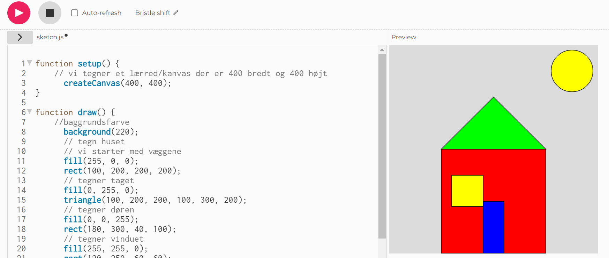
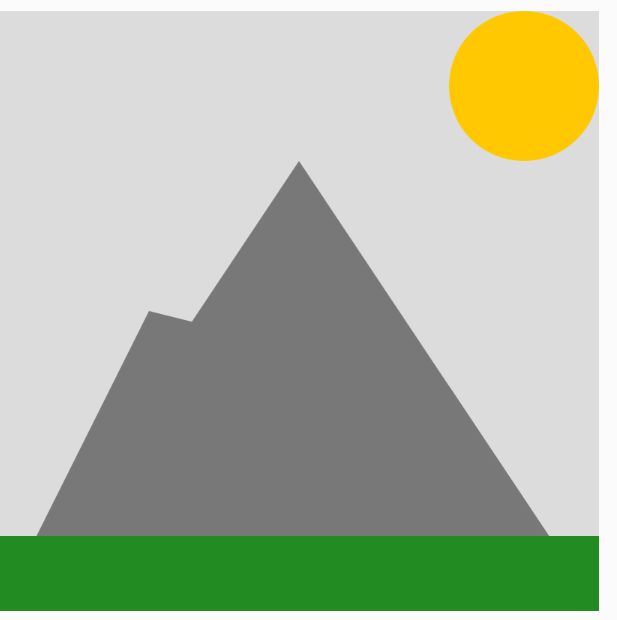

# 2. Dine første programmer i P5 og Javascript

Et program består af en række instruktioner, som en maskine (eksempelvis en computer, telefon, bil, køleskab etc) kan forstå og afvikle, og programmering betegner den proces hvor man ud fra nogle formelle regler skriver disse instruktioner og herigennem konstruerer et program.

Vi kan bruge Javascript og biblioteket P5 til at programmere i. Når vi gør det, kan vi tænke på det at programmere som at lave en tegning i P5, hvor den endelige tegning udgør programmet. 

I det følgende skal vi arbejde med at konstruere simple geometriske former som kan blive til en form for automatiseret tegninger eller animationer. Dvs. disse tegninger eller animationer udgør i første omgang vores programmer. Vi opfordrer læseren til at prøve programmerne af undervejs og gerne eksperimentere med at justere på de enkelte instruktioner. 

Det bemærkes, at til at starte med skriver vi vores kode på p5js.org. Her er det  nok bare at trykke "Editor" på p5js.org, men hvis man eksempelvis ønsker at gemme sine programmer, så er det nødvendigt at logge ind/oprette en konto. Alt sammen er grundigt forklaret i kapitel 17 hvor man bl.a. får en udførlig vejledning i brug af editoren (hvor koden skrives) på p5js.org i kapitel 17. 
 
## En tegning bliver til
Herunder følger vores første kodeeksempel, som skaber en illustration af et hus og en sol på et lærred/kanvas ud fra simple geometriske former. Du skal være velkommen til at prøve koden af og eksperimentere med koden: 

```javascript
// lav en setup funktion der tegner et lærred 400x400
// på lærredet tegnes et simpelt hus

function setup() {
    // vi tegner et lærred/kanvas der er 400 bredt og 400 højt
	  createCanvas(400, 400);
}

function draw() {
    //baggrundsfarve
	  background(220);
	  // tegn huset
	  // vi starter med væggene
	  fill(255, 0, 0);
	  rect(100, 200, 200, 200);
	  // tegner taget
	  fill(0, 255, 0);
	  triangle(100, 200, 200, 100, 300, 200);
	  // tegner døren
	  fill(0, 0, 255);
	  rect(180, 300, 40, 100);
	  // tegner vinduet
	  fill(255, 255, 0);
	  rect(120, 250, 60, 60);
	  // tegner solen
	  fill(255, 255, 0);
	  ellipse(350, 50, 80, 80);
}
```
Taster vi koden ovenfor ind i editoren og trykker på `Play`-knappen skulle vi gerne få en tegning af et hus vist på lærredet/kanvas til højre for kodefeltet: 





Ud fra ovenstående eksempel ser vi, at et program i P5, typisk består af to dele også kaldet funktioner. Funktionen `setup()` er her programmet er sat til at starte og linjerne mellem krølparenteserne er de første såkaldte `instruktioner`, som afvikles. 

Krølparenteserne indikerer en såkaldt `sekvens`, som er en række instruktioner, der udføres i sammenhæng. Man siger også, at instruktionerne i en sekvens udføres sekventielt. En instruktion ad gangen fra øverste til nederste linje. 
Til at starte med begynder vi i vores `setup()` med en kommentar, som er angivet ved to skråstreger. Kommentarer er primært med for at dokumentere og formidle kodens funktionalitet men har ingen betydning for det egentlige program. Dernæst tegnes lærredet eller kanvas, som kalder en indbygget funktion i P5 kaldet `createCanvas(400, 400)`. Den tager to parametre i form af tallene 400 hhv. 400, der indikerer bredden hhv
højden af lærredet. 

Efter `setup()` der kun afvikles en gang i starten af programmet, kaldes automatisk funktionen `draw()`. Særligt for denne funktion er, at den i resten af programmet vil blive kaldt igen og igen. Dvs. programmet gentegner i praksis huset mange gange i sekundet, så hurtigt at det menneskelige øje ikke opdager det.  
Kaldet til `background` indikerer baggrundsfarven ud fra en sort-hvid skala og denne kommando overmaler lærredet.  
Du undrer dig måske over tallene angivet mellem parenteserne. Det er reelt bare nogle koordinater og mål for de geometriske former. Det vender vi tilbage til i næste afsnit. 

## Koordinatsystemer og geometriske former i P5.JS

På figuren nedenfor ses til venstre et koordinatsystem, som vi kender det fra matematikundervisningen. Det indbyggede koordinatsystem i P5 er på figuren vist til højre: 


Vi bemærker, at koordinatsystemets centrum er placeret øverst i venstre hjørne og at den positive y-akse går modsat vej af hvad vi er vant til. Det er muligt at justere på disse ting, men i praksis viser det sig at være smart, da vi bl.a. undgår at skulle forholde os til negative koordinater. 

Vi konstruere herunder et program, som visualiserer en række punkter, linjer, rektangler, ellipser og cirkler:

```javascript
function setup(){
    // størrelsen af vores tegneflade også kaldet kanvas 
    // (800,800) markerer brede og og længde
  	createCanvas(800, 800);
}
function draw(){
 // point(x, y) hvor x og y refererer til placeringen af punktet: 
 point(400, 500); 
 // line(x1, y1, x2, y2) hvor (x1,y1) og (x2,y2) refererer til placering af endepunkter
 line(100, 200, 500, 700); // line(x1, y1, x2, y2) hvor tallene 
 // rect(x, y, width, height) hvor (x,y) er punktet i øverste, vesntre hjørne og width og height
 // er bredde hhv højde
 rect(100, 100, 400, 300); 
 // ellipse(x, y, width, height) , hvor (x,y) er centrum af ellipsen 
 // width hhv. height er længden af stor- hhv lille-aksen
 ellipse(300, 300, 400, 200); // ellipse(x, y, width, height)
 // circle(x,y,r), hvor (x,y) er centrum og r er radisus
 circle(400, 400,400); // ellipse(x, y, width, height)
}
```

Som nævnt tidligere så initialiseres i  `setup ` programmet (instruktionerne herinde afvikles en gang og som det allerførste i programmet). I det her tilfælde konstruerer vi igen blot lærredet. 

I `draw`  skrives denne gang kode, som tegner figurerne på kanvas forskellige steder på skærmen. Bemærk at koden i draw afvikles som standard 30 gange i sekundet.  
De to skråstreger indikerer at den efterfølgende tekst er en kommentarer, som ikke fortolkes af computeren. 

Et gammelt ordsprog siger, at der er mange veje til Rom. På samme måde forholder det sig til programmering. Vi kan ofte skrive de samme programmer på et utal af måder Det er noget af det, som gør programmering til en kreativ og sjov proces. 

En af grundene til, at vi kan skrive de samme programmer på mange forskellige måder, hænger bl.a. sammen med, at vi ofte kan udtrykke resultatet af de enkelte instruktioner på forskellige vis. Det ser vi eksempelvis med en cirkel, der kan i virkeligheden blot er et specialtilfælde af en ellipse. 
Et andet eksempel er rektangler konstrueres ud fra deres hjørner:

```javascript
function setup(){
 createCanvas(100, 100);
 rectMode(CENTER);
}
function draw(){
// rect(x, y, width, height) hvor (x,y) er centrum
 // width og højde er bredde hhv højde
 rect(30, 20, 40, 20); 
}
```
Herunder et eksempel hvor der tegnes ansigtet af en simpel tøjbamse:
```javascript
function setup() {
	createCanvas(400, 400);
  rectMode(CENTER);
}

function draw() {
	background(220);
  fill(255, 255, 0);
  ellipse(200, 200, 300, 300);
  fill(0);
  ellipse(150, 150, 50, 50);
  ellipse(250, 150, 50, 50);
  fill(255, 0, 0);
  rect(200, 250, 100, 50);
  fill(0);
  triangle(200, 200, 150, 250, 250, 250);
}
```

Man kan ændre tykkelsen af streger på følgende måde:

```javascript
strokeWeight(1); // Standard
line(20, 20, 80, 20);
strokeWeight(4); // Tykkere
line(20, 40, 80, 40);
strokeWeight(10); // Fed
line(20, 70, 80, 70);
```

## Firkanter
Indtil nu har vi kun set hvorledes man kan tegne rektangler. Ved brug af `quad` kan vi tegne firkanter, der har forskellige vinkler og sidelængder. 
```javascript
// x1, y1 svarer til koordinaterne for det første punkt
// x2, y2 svarer til koordinaterne for det andet punkt
// x3, y3 svarer til koordinaterne for det tredje punkt
// x4, y4 svarer til koordinaterne for det trejde punkt
quad(x1, y1, x2, y2, x3, y3, x4, y4)
```
Herunder et eksempel hvor vi konstruerer et simpelt bjerglandskab vha af et kald til `quad`:

```javascript
function setup() {
  createCanvas(400, 400);
}

function draw() {
  background(220);
  
  // Tegn bjerge
  fill(120);
  noStroke();
  
  // Første bjerg
  triangle(0, 400, 200, 100, 400, 400);
  
  // Anden bjerg
  quad(0, 400, 100, 200, 300, 250, 400, 400);
  
  // Tredje bjerg
  triangle(0, 400, 100, 300, 200, 200);
  
  // Solen
  fill(255, 200, 0);
  noStroke();
  ellipse(350, 50, 100, 100);
  
  // Jorden
  fill(34, 139, 34);
  noStroke();
  rect(0, 350, 400, 50);
}
```
Herunder ses resultatet af koden:



## Polygoner ved brug af punkter
Vi behøver ikke nøjes med at lave trekanter og firkanter, men kan i stedet lave et polygon bestående af mange punkter der forbindes ved brug af linjer ved at bruge `beginShape()` efterfulgt af punkter og afsluttet med `endShape(CLOSE)`:

```javascript
beginShape(); 
  vertex(x1, y1); 
  vertex(x2, y2);
  ....
endShape(CLOSE); 
```

Herunder tegnes en pil:
```javascript
function setup() { 
 createCanvas(480, 120); 
} 
function draw() { 
 background(204); 
 beginShape(); 
  vertex(180, 82); 
  vertex(207, 36); 
  vertex(214, 63); 
  vertex(407, 11); 
  vertex(412, 30); 
  vertex(219, 82); 
  vertex(226, 109); 
 endShape(CLOSE); 
}
```

Herunder tegnes det samme hus fra tidligere blot ved brug af polygoner i stedet for:

```javascript

function setup() {
	  createCanvas(400, 400);
}

function draw() {
	  //baggrundsfarve
	  background(220);
	  // tegn huset
	  // vi starter med væggene
	  fill(255, 0, 0);
	  beginShape();
	  vertex(100, 200);
	  vertex(300, 200);
	  vertex(300, 400);
	  vertex(100, 400);
	  endShape(CLOSE);
	  // tegner taget
	  fill(0, 255, 0);
	  beginShape();
	  vertex(100, 200);
	  vertex(200, 100);
	  vertex(300, 200);
	  endShape(CLOSE);
	  // tegner døren
	  fill(0, 0, 255);
	  beginShape();
	  vertex(180, 300);
	  vertex(220, 300);
	  vertex(220, 400);
	  vertex(180, 400);
	  endShape(CLOSE);
	  // tegner vinduet
	  fill(255, 255, 0);
	  beginShape();
	  vertex(120, 250);
	  vertex(180, 250);
	  vertex(180, 310);
	  vertex(120, 310);
	  endShape(CLOSE);
	  // tegner solen
	  fill(255, 255, 0);
	  ellipse(350, 50, 80, 80);
}
```

## Kommentarer

Man kan som nævnt skrive kommentarer i sin kode ved at skrive to skråstreger "//". Alternativt brug "/*" og så vil alt være kommentarer indtil man igen skriver */. Herunder et par eksempler.

```javascript
function setup() { 
 // Her et eksempel på en enkelt linjes kommentar i setup

} 
function draw() { 
 /* Her er et eksempel på en kommentar 
    over flere linjer.
    Vi kan skrive lige så mange linjer som man har lyst til
  */
}
```
Det er en god ide løbende at dokumentere sine kode og forklare hvad den gør. Vi skal senere vende tilbage til hvorledes det kan gøres systematisk. Men indtilvidere vil vi foreslå, at du løbende skriver en linje eller to om hvad din kode gør. Det gælder både så andre nemmere kan forstå hvad du skriver men også i forhold til, at du selv kan huske hvad du tænkte den dag, hvor du skrev koden. Man bliver ofte overrasket hvor hurtig man glemmer hvad det var man tænkte, da man skrev noget kode. 

## Farver

Vi skal være præcise når vi vil farvelægge former. For sort til hvid og nuancer herimellem gælder følgende farveskema:


Herunder ses hvordan man ændrer farven på baggrund og et rektangel:


```javascript
background(255);  // hvid baggrund
stroke(0);        // farve til sort
fill(150);        // indre form grå
rect(50,50,75,100); // tegner rektangel
```


Vil vi have farver så skal vi bruge RGB (Red, Green, Blue):


<table>
  <tr>
   <td>


   </td>
   <td>Rød + grøn =gul
<p>
Red + blå = lilla
<p>
Grøn og blå = blå-grøn
<p>
Rød + grøn + blå = hvid
<p>
Ingen farver = sort
   </td>
  </tr>
</table>


Nuancen af rød, grøn og blå angives med tallene 0 til 255 for alle tre farver. Herunder et eksempel


```javascript
function draw() {
  background(255);
  noStroke();

  // Bright red
  fill(255,0,0);
  ellipse(20,20,16,16);

  // Dark red
  fill(127,0,0);
  ellipse(40,20,16,16);

  // Pink (pale red)
  fill(255,200,200);
  ellipse(60,20,16,16);
}
```

## Framerate (billeder pr sekund)
Metoden draw opdateres som nævnt 30 gange i sekundet.  Det kaldes også 30 FPS - Frames Per Second. Det betyder, at linjerne mellem krølparenteserne i `draw` afvikles 30 gange i sekundet. Du sætter antallet af frames i setup ved brug af kommandoen


```javascript
frameRate(x); //x er antallet af frames
```

Overvej altid om du bør eller ikke bør have en background kommando med, da den sørger for at rense kanvas, så noget nyt kan tegnes. Hvis du ikke har objekter, der bevæger sig dynamisk kan det overvejes om det er nødvendigt at rense kanvas. 


## Tilfældige tal ved brug af random

Man kan generere tilfældige farver ved at bruge en den indbyggede tilfældighedsgenerator, som vi også kalder for random, der bl.a. kan generere tilfældige heltal på følgende måde:


```javascript
random(50); // giver et tilfældigt tal mellem 0 og 50
random(-50,50); //giver et tilfældigt tal mellem -50 og 50
```


Funktionen viser sig at være ekstremt nyttig i mange sammenhænge, men til at starte med kan den eksempelvis bruges til at tildele en geometrisk form en vilkårlig farve eller placering:


```javascript
fill(random(250),random(250),random(250)); //en tilfældig RGB-farve
ellipse(random(75),random(75),50,50); //en tilfældig position for en cirkel
```
Herunder tegnes forskellige geometriske objekter med forskellige placering på kanvas:
```javascript

function setup() {
	  createCanvas(500, 500);
}

function draw() {
	  background(0);
	  stroke(255);
	  fill(255);
	  circle(random(width), random(height), random(100));
	  rect(random(width), random(height), random(100), random(100));
	  line(random(width), random(height), random(width), random(height));
	  triangle(random(width), random(height), random(width), random(height), random(width), random(height));
	  point(random(width), random(height));
}
```
Vi skal senere se, at tilfældighed kan bruges i rigtig mange forskellige sammenhænge.

## Skrive til konsollen

Man har mulighed for at skrive til konsollen, som man tilgår via Ctrl+Shift+J i de fleste browsere.


```javascript
var i = 0;
function setup() {
  createCanvas(400, 400);
  console.log("HEJ her fra setup");

}
function draw() {
  background(220);
  console.log("Hej her fra draw"+ i );
  i=i+1;
}
```


Her opretter vi en heltalsvariable (en såkaldt tællevariable), som vi inkrementerer  i metoderne i `draw `og printer i både `draw ` og `setup`. Førstnævnte kaldes 30 gange i sekundet, mens setup kun kører en gang. Bemærk vi kan sagtens skrive kode uden for de to metoder og vi kan sågar lave vores egne metoder. Men det vender vi tilbage til senere ligesom vi også går i dybden med variabler i næste kapitel.


## Afvikling på p5js.org eller egen computer
Indtil nu har vi afviklet programmer på vores p5’s hjemmeside via editoren og dette kan man sagtens forsætte med i de næste par kapitler, hvis man synes det er sjovere at kode der.  

Men på et tidspunkt vil det måske være rart med en lidt mere avanceret editor eller et decideret udviklingsmiljø.  
Det er praktisk af mange grunde. Bl.a.  får vi lettere ved at skrive større mængder kode fordelt på flere filer og vi får en række værktøjer til at skrive kode hurtigere og med færre fejl. 

Vi vælger at bruge Visual Studio Code, som er open source og gratis. Den kan hentes på [https://code.visualstudio.com/](https://code.visualstudio.com/) til stort set alle platforme (herunder Windows, Mac og linux).

Visual Studio Code (VSC) er en slags Word for programmører og vi skriver fremover al vores kode heri. I VSC skal du installere tre plugins:

* Live Server
* P5 JS snippets
* p5.vscode

Når du har installeret disse kan du nøjes med at trykke Ctrl + Shift + p og skrive Create. Herefter kommer der en valgmulighed, som hedder Create P5 JS project. Vælg den og vælg en mappe hvor dine filer skal ligge. I mappen kommer der en række filer og et enkelt bibliotek:

<span style="text-decoration:underline;">Libraries</span>: Mappen med p5.js filer. Den skal du ikke røre ved.

<span style="text-decoration:underline;">Index.html</span>: Hjemmesiden hvor du linker til din javascript kode og style sheet. Ser herunder.

<span style="text-decoration:underline;">Script.src</span>: Her er funktionerne setup og draw. Det er her du skal skrive din kode indtil videre.

<span style="text-decoration:underline;">Style.css</span>: Her kan du skrive style sheets der ændrer på hjemmesidens udseende. Undlad at kigge på den nu.

I kapitel 17 gennemgår vi i langt flere detajler  hvorledes Visual Studio Code installeres og bruges i praksis.


## Øvelser 
Herunder følger en række øvelser. Lav som minimum øvelserne 1. til 9. Dele af projektet kan også være sjovt at lave. 

1. Tegn de forskellige geometriske former i forskellige farver og i forskellige størrelser.
2. Gør baggrunden mørkeblå. Tegn to linjer der krydser diagonalt i en hvid farve. 
3. Tegn OL-logoet i farver
4. Tegn et hus. Farvelæg det.
5. Tegn et dyr ved brug af de geometriske former. Farvelæg det.
6. Tegn et simpelt potræt af et menneske. Brug rektangler, cirkler og linjer etc. til at tegne øjne, næse og mund.  
7. Konstruér en stjerne. To gode funktioner at kende er "translate(x,y)", som definerer omdrejningspunktet og "rotate(vinkel i radianer)", der roterer de efterfølgende objekter i radianer med uret. Til orientering kan man konvertere mellem radianer og grader ved følgende formler: $$radianer= \frac{grader}{180}*\pi $$ $$grader= \frac{radianer}{pi}*180 $$
8. Konstruér en blomst ved brug af cirkler og ellipser.
9. Konstruer din egen figur ved hjælp af beginShape og endShape.
10. Brug simple geometriske figurer til at tegne konturerne af et dyr. 
11. Konstruer en række punkter, der illustrerer konturerne af det samme dyr som i foregående opgave. Overvej hvilken af disse programmer er mest enkle, selvforklarende og læsbar.
12. Prøv ved brug af geometriske primitiver såsom cirkler, firkanter eller linjer at skabe en illusion af en tre-dimensionel figur. Det kunne eksempelvis være en kugle, en kegle eller en kasse. 
13. Du er ved at starte din egen virksomhed og har brug for at kunne autogenerere dit firmas logo. Skriv et program der konstruerer dit logo.
14. Bestem selv om du vil vente med denne øvelse. Installér Visual Studio Code og følgende plugins:
    1. Live Server til at afvikle en lokal webserver
    2. P5 Project Creator
    3. P5js Snippets
Se en udførlig vejledning i kapitel 17.


## Projekt: Algoritmisk flag konstruktion

Du har startet en virksomhed op som producerer flag automatisk og digitalt i P5. Flere lande har allerede efterspurgt om deres flag kan blive konstrueret i P5 og en beskrivelse (dvs. en algoritme), der skridt for skridt fortæller hvordan flaget visualiseres vha computeren. Det drejer sig om følgende lande:


Du skal altså gøre følgende

* a. Skriv med ord på helt almindelig dansk hvorledes du vil konstruere et flag. Denne form for kode kaldes pseudokode. 
* b. Skriv koden der rent faktisk visualisere flaget.
* c. Udfør a. og b. for et selvvalgt flag. 

Pseudokode for eksempelvis det japanske flag kunne lyde i retning af følgende:

* Konstruer et kanvas med hvid bagrund
* Tegn en rød cirkel i midten af kanvas
* Fyld cirklen med en rød farve

Hvis du kender andre, som er ved at lære p5 kan det være en fordel at prøve at give din beskrivelse i a. til vedkommende, og se om vedkommende kan visualisere dit flag. 

Ofte er den bedste måde at kommunikere kode til andre på ikke nødvendigvis ved at tage udgangspunkt i selve koden men i stedet at kommunikere i pseudokode eller lignende.
Ydermere er det også en god måde at dokukumentere sin kode på, hvis andre skal læse den eller hvis man selv vender tilbage til koden en dag. Man vil blive overrasket over hvor hurtigt man kan glemmer tankegangen og ideer man havde, da man udviklede et program. 

Det er generelt en vigtigt egenskab for alle programmører at være bevidst om hvorledes man bedst kommunikerer funktionaliteten og strukturen i sit program, og at programmer ofte kan repræsenteres ikke kun som den egentlig kode men også i almindelig tekst, figurer eller noget helt tredje. 