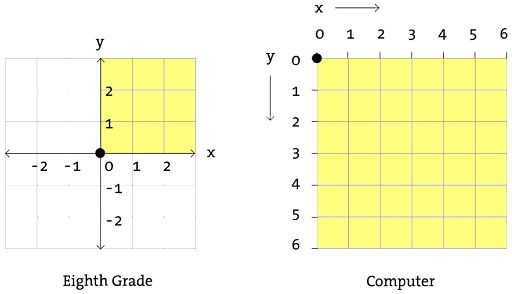
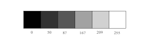
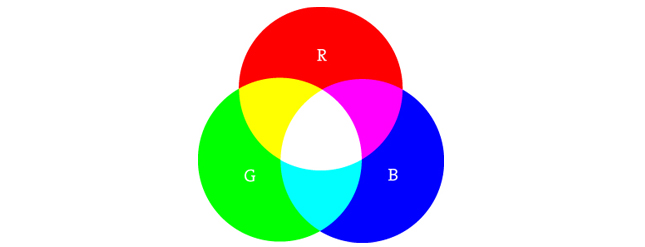
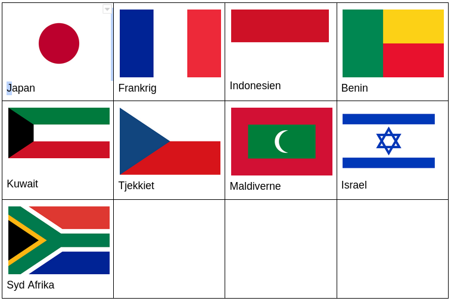

# 2. Dine første programmer i P5 og Javascript

Et program består af en række instruktioner, som en maskine (computer, telefon, bil, køleskab etc)  forstår. Programmering betegner den proces hvor man ud fra nogle formelle regler konstruerer programmet.

Vi kan tænke på det at programmere som at lave en tegning, hvor den endelige tegning udgør programmet. I det følgende skal vi arbejde med at konstruere simple geometriske former som kan blive til en form for automatiseret tegninger eller animationer. Dvs. disse tegninger eller animationer udgør vores programmer.

Det bemærkes, at til at starte med skriver vi vores kode på p5js.org. Her er det  nok bare at trykke "Editor" på p5js.org, men hvis man eksempelvis ønsker at gemme sine programmer, så er det nødvendigt at logge ind/oprette en konto. Alt sammen er grundigt forklaret i kapitel 17 hvor man bl.a. får en udførlig vejledning i brug af editoren (hvor koden skrives) på p5js.org i kapitel 17. 
 

## Koordinatsystemer og geometriske former i P5.JS

På figuren nedenfor ses til venstre et koordinatsystem, som vi kender det fra matematikundervisningen. Det indbyggede koordinatsystem i P5 er på figuren vist til højre: 



Vi konstruere punkter, linjer, rektangler, ellipser og cirkler nedenfor:

```javascript
function setup(){
    // størrelsen af vores tegneflade også kaldet kanvas 
    // (100,100) markerer brede og og længde
  	createCanvas(100, 100);
}
function draw(){
 // point(x, y) hvor x og y refererer til placeringen af punktet: 
 point(40, 50); 
 // line(x1, y1, x2, y2) hvor (x1,y1) og (x2,y2) refererer til placering af endepunkter
 line(10, 20, 50, 20); // line(x1, y1, x2, y2) hvor tallene 
 // rect(x, y, width, height) hvor (x,y) er punktet i øverste, vesntre hjørne og width og height
 // er bredde hhv højde
 rect(10, 20, 40, 30); 
 // ellipse(x, y, width, height) , hvor (x,y) er centrum af ellipsen 
 // width hhv. height er længden af stor- hhv lille-aksen
 ellipse(30, 30, 40, 60); // ellipse(x, y, width, height)
 ellipse(30, 30, 40, 40); // ellipse(x, y, width, height)
}
```
Sidstnævnte bliver til en cirkel. Hvorfor mon?

I `setup ` initialiseres programmet (instruktionerne herinde afvikles en gang og som det allerførste i programmet). I det her tilfælde konstruerer vi blot tegnefladen, som vi fremover også kalder for et kanvas. Det er her vores illustrationer og objekter fremkommer.  

I `draw`  skrives den kode, som tegner figurerne på kanvas. Bemærk at koden i draw afvikles som standard 30 gange i sekundet.  
De to skråstreger indikerer at der er tale om kommentarer, som ikke fortolkes af computeren. Den opfatter det som kommentarer. Krølparenteser markerer start og slut på de to såkaldte metoder, `setup` og `draw`. 

Alternativt kan rektangler eksempelvis konstrueres ud fra deres hjørner:

```javascript
function setup(){
 createCanvas(100, 100);
 rectMode(CENTER);
}
function draw(){
// rect(x, y, width, height) hvor (x,y) er centrum
 // width og højde er bredde hhv højde
 rect(30, 20, 40, 20); 
}
```
Man kan ændre tykkelsen af streger på følgende måde:

```javascript
strokeWeight(1); // Standard
line(20, 20, 80, 20);
strokeWeight(4); // Tykkere
line(20, 40, 80, 40);
strokeWeight(10); // Fed
line(20, 70, 80, 70);
```
Man kan lave en form bestående af mange punkter der forbindes ved brug af linjer ved at bruge shape. Herunder tegnes en pil:

```javascript
function setup() { 
 createCanvas(480, 120); 
} 
function draw() { 
 background(204); 
 beginShape(); 
  vertex(180, 82); 
  vertex(207, 36); 
  vertex(214, 63); 
  vertex(407, 11); 
  vertex(412, 30); 
  vertex(219, 82); 
  vertex(226, 109); 
 endShape(CLOSE); 
}
```

## Kommentarer

Man kan som nævnt skrive kommentarer i sin kode ved at skrive to skråstreger "//". Alternativt brug "/*" og så vil alt være kommentarer indtil man igen skriver */. Herunder et par eksempler.

```javascript
function setup() { 
 // Her et eksempel på en enkelt linjes kommentar i setup

} 
function draw() { 
 /* Her er et eksempel på en kommentar 
    over flere linjer.
    Vi kan skrive lige så mange linjer som man har lyst til
  */
}
```

## Farver

Vi skal være præcise når vi vil farvelægge former. For sort til hvid og nuancer herimellem gælder følgende farveskema:




Herunder ses hvordan man ændrer farven på baggrund og et rektangel:


```javascript
background(255);  // hvid baggrund
stroke(0);        // farve til sort
fill(150);        // indre form grå
rect(50,50,75,100); // tegner rektangel
```


Vil vi have farver så skal vi bruge RGB (Red, Green, Blue):


<table>
  <tr>
   <td>




   </td>
   <td>Rød + grøn =gul
<p>
Red + blå = lilla
<p>
Grøn og blå = blå-grøn
<p>
Rød + grøn + blå = hvid
<p>
Ingen farver = sort
   </td>
  </tr>
</table>


Nuancen af rød, grøn og blå angives med tallene 0 til 255 for alle tre farver. Herunder et eksempel


```javascript
function draw() {
  background(255);
  noStroke();

  // Bright red
  fill(255,0,0);
  ellipse(20,20,16,16);

  // Dark red
  fill(127,0,0);
  ellipse(40,20,16,16);

  // Pink (pale red)
  fill(255,200,200);
  ellipse(60,20,16,16);
}
```


Metoden draw opdateres som nævnt 30 gange i sekundet.  Det kaldes også 30 FPS - Frames Per Second. Det betyder, at linjerne mellem krølparenteserne i draw afvikles 30 gange i sekundet. Du sætter antallet af frames i setup ved brug af kommandoen


```javascript
frameRate(x); //x er antallet af frames
```

Overvej altid om du bør eller ikke bør have en background kommando med, da den sørger for at rense kanvas, så noget nyt kan tegnes. Hvis du ikke har objekter, der bevæger sig dynamisk kan det overvejes om det er nødvendigt at rense kanvas. 


## Tilfældige tal ved brug af random

Man kan generere tilfældige farver ved at bruge en den indbyggede tilfældighedsgenerator, som vi også kalder for random, der bl.a. kan generere tilfældige heltal på følgende måde:


```javascript
random(50); // giver et tilfældigt tal mellem 0 og 50
random(-50,50); //giver et tilfældigt tal mellem -50 og 50
```


Funktionen viser sig at være ekstremt nyttig i mange sammenhænge, men til at starte med kan den eksempelvis bruges til at tildele en geometrisk form en vilkårlig farve eller placering:


```javascript
fill(random(250),random(250),random(250)); //en tilfældig RGB-farve
ellipse(random(75),random(75),50,50); //en tilfældig position for en cirkel
```


## Skrive til konsollen

Man har mulighed for at skrive til konsolen, som man tilgår via Ctrl+Shift+J i de fleste browsere.


```javascript
var i = 0;
function setup() {
  createCanvas(400, 400);
  console.log("HEJ her fra setup");

}
function draw() {
  background(220);
  console.log("Hej her fra draw"+ i );
  i=i+1;
}
```


Her opretter vi en heltalsvariable (en såkaldt tællevariable), som vi inkrementerer  i metoderne i `draw `og printer i både `draw ` og `setup`. Førstnævnte kaldes 30 gange i sekundet, mens setup kun kører en gang. Bemærk vi kan sagtens skrive kode uden for de to metoder og vi kan sågar lave vores egne metoder. Men det vender vi tilbage til senere.


## Afvikling på p5js.org eller egen computer
Indtil nu har vi afviklet applikationer på vores p5’s hjemmeside via editoren og dette kan man sagtens forsætte med i de næste par kapitler, hvis man synes det er sjovere at kode.  

Men på et tidspunkt vil det måske være rart med en lidt mere avanceret editor eller et decideret udviklingsmiljø.  
Det er praktisk af mange grunde. Bl.a.  får vi lettere ved at skrive større mængder kode fordelt på flere filer og vi får en række værktøjer til at skrive kode hurtigere og med færre fejl. 

Vi vælger at bruge Visual Studio Code, som er open source og gratis. Den kan hentes på [https://code.visualstudio.com/](https://code.visualstudio.com/) til stort set alle platforme (herunder Windows, Mac og linux).

Visual Studio Code (VSC) er en slags Word for programmører og vi skriver fremover al vores kode heri. I VSC skal du installere tre plugins:

* Live Server
* P5 JS snippets
* p5.vscode

Når du har installeret disse kan du nøjes med at trykke Ctrl + Shift + p og skrive Create. Herefter kommer der en valgmulighed, som hedder Create P5 JS project. Vælg den og vælg en mappe hvor dine filer skal ligge. I mappen kommer der en række filer og et enkelt bibliotek:

<span style="text-decoration:underline;">Libraries</span>: Mappen med p5.js filer. Den skal du ikke røre ved.

<span style="text-decoration:underline;">Index.html</span>: Hjemmesiden hvor du linker til din javascript kode og style sheet. Ser herunder.

<span style="text-decoration:underline;">Script.src</span>: Her er funktionerne setup og draw. Det er her du skal skrive din kode indtil videre.

<span style="text-decoration:underline;">Style.css</span>: Her kan du skrive style sheets der ændrer på hjemmesidens udseende. Undlad at kigge på den nu.

I kapitel 17 gennemgår vi i langt flere detajler  hvorledes Visual Studio Code installeres og bruges i praksis.


## Øvelser 
Herunder følger en række øvelser. Lav som minimum øvelserne 1. til 9. Dele af projektet kan også være sjovt at lave. 

1. Tegn de forskellige geometriske former i forskellige farver og i forskellige størrelser.
2. Gør baggrunden mørkeblå. Tegn to linjer der krydser diagonalt i en hvid farve. 
3. Tegn OL-logoet i farver
4. Tegn et hus. Farvelæg det.
5. Tegn et dyr ved brug af de geometriske former. Farvelæg det.
6. Tegn et simpelt potræt af et menneske. Brug rektangler, cirkler og linjer etc. til at tegne øjne, næse og mund.  
7. Konstruér en stjerne. To gode funktioner at kende er "translate(x,y)", som definerer omdrejningspunktet og "rotate(vinkel i radianer)", der roterer de efterfølgende objekter i radianer med uret. Til orientering kan man konvertere mellem radianer og grader ved følgende formler: $$radianer= \frac{grader}{180}*\pi $$ $$grader= \frac{radianer}{pi}*180 $$
8. Konstruér en blomst ved brug af cirkler og ellipser.
9. Konstruer din egen figur ved hjælp af beginShape og endShape.
10. Prøv ved brug af geometriske primitiver såsom cirkler, firkanter eller linjer at skabe en illusion af en tre-dimensionel figur. Det kunne eksempelvis være en kugle, en kegle eller en kasse. 
11. Du er ved at starte din egen virksomhed og har brug for at kunne autogenerere dit firmas logo. Skriv et program der konstruerer dit logo.
12. Bestem selv om du vil vente med denne øvelse. Installér Visual Studio Code og følgende plugins:
    1. Live Server til at afvikle en lokal webserver
    2. P5 Project Creator
    3. P5js Snippets
Se en udførlig vejledning i kapitel 17.


## Projekt: Algoritmisk flag konstruktion

Du har startet en virksomhed op som producerer flag automatisk og digitalt i P5. Flere lande har allerede efterspurgt om deres flag kan blive konstrueret i P5 og en beskrivelse (dvs. en algoritme), der skridt for skridt fortæller hvordan flaget visualiseres vha computeren. Det drejer sig om følgende lande:



Du skal altså gøre følgende

* a. Skriv med ord på helt almindelig dansk hvorledes du vil konstruere et flag. Denne form for kode kaldes pseudokode. 
* b. Skriv koden der rent faktisk visualisere flaget.
* c. Udfør a. og b. for et selvvalgt flag. 

Pseudokode for eksempelvis det japanske flag kunne lyde i retning af følgende:

* Konstruer et kanvas med hvid bagrund
* Tegn en rød cirkel i midten af kanvas
* Fyld cirklen med en rød farve

Hvis du kender andre, som er ved at lære p5 kan det være en fordel at prøve at give din beskrivelse i a. til vedkommende, og se om vedkommende kan visualisere dit flag. 

Ofte er den bedste måde at kommunikere kode til andre på ikke nødvendigvis ved at tage udgangspunkt i selve koden men i stedet at kommunikere i pseudokode eller lignende.
Ydermere er det også en god måde at dokukumentere sin kode på, hvis andre skal læse den eller hvis man selv vender tilbage til koden en dag. Man vil blive overrasket over hvor hurtigt man kan glemmer tankegangen og ideer man havde, da man udviklede et program. 

Det er generelt en vigtigt egenskab for alle programmører at være bevidst om hvorledes man bedst kommunikerer funktionaliteten og strukturen i sit program, og at programmer ofte kan repræsenteres ikke kun som den egentlig kode men også i almindelig tekst, figurer eller noget helt tredje. 