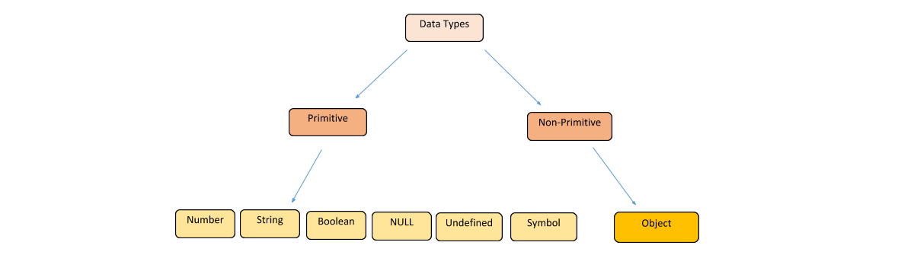

# 3. Variabler, animationer og input
Variabler udgør de centrale byggesten i ethvert program. Variabler kan tænkes på som navngivne pladser i computerens hukommelse, og de bruges til at opbevare data af forskellige typer. Det skal vi kigge nærmere på nedenfor, hvor vi også vil se på hvorledes man håndterer input fra brugeren i form af taster på tastaturet eller input fra musen. 
Undervejs ser vi også eksempler på hvorledes man kan lave ikke bare statiske tegninger men også animationer. 


## Variabler og datatyper

Variabler bruges til at opbevare data.  Dataens “form” eller type kaldes også datatypen. Når man erklærer eller konstruerer en variable, så reserverer vi en plads i computerens hukommelse, hvor variablens værdi opbevares. 
Man erklærer variabler ved at bruge nøgleordet **let **, **var** eller **const** i kombination med tildelingsoperatoren.  Helt overordnet vil en erklæring se således ud:

<p align="center">
<b>let</b> <i>variablenavn</i> <b>=</b> <i>værdi</i><br>
<b>var</b> <i>variablenavn</i> <b>=</b> <i>værdi</i><br>
<b>const</b> <i>variablenavn</i> <b>=</b> <i>værdi</i>
</p>
Bemærk variablenavn skal erstattes med et navn, som du vælger. Det bør gerne være sigende for den værdi variablen skal indeholde. Værdien angives på højre side skal angives i stedet for værdi.
Vi skal senere studere forskellen på brugen af let, var og const i detaljer. En væsentlig forskel er, at const ikke kan ændres i værdi eller erklæres på ny. Den er som nøgleordet antyder konstant. "let" blev introduceret i 2015 og er typisk den måde variabler erklæres på i moderne javascript. Ældre applikationer bruger dog stadig var og det kan nogle få gange være relevant at bruge. Men generelt er rådet at bruge let så meget som muligt, da det typisk reducerer risikoen for fejl. Vi vil derfor primært fokusere på at bruge let  forskellen på og hvorfor "let" er at foretrække.

Herunder nogle eksempler på erklæringer af forskellige variabler og initialiseringer af :

```javascript
let n = 1; // variablen n peger nu på tallet 1 
var m = 2; // variablen n peger nu på tallet 2 
const p = 3 // variablen p peger nu på tallet 3 og kan ikke ændres/erklæres på ny
let s = "Hej"; // variablen s peger nu på teksten "Hej"
var t = "med dig"; // variablen t peger nu på teksten "Hej"
const r = "Halløj"; // variablen r peger nu på teksten "Halløj" og kan ikke ændres/erklæres på ny
```
Disse eksempler illustrerer brugen af de tre nøgleord til at erklære og dermed konstruere nogle forskellige variable med forskellige værdier. Når vi nu bruger variablenavnene i en kontekst udgør de en pladsholder for den konkrete værdi, som vi har     

Der findes overordnet syv forskellige typer i javascript:



I følgende kapitel vil vi primært fokusere på de primitive typer kaldet 
* "Number": Der består af heltal (integers på engelsk) og kommatal (floats på engelsk).  
* "String": Der består af strenge af tekst eller karakterer.  
* "Boolean": Der består af de boolske værdier true og false.  
  
Vi vender senere tilbage til de andre typer.

Javascript er et såkaldt dynamisk typet sprog. Dvs. at du ikke på forhånd behøver at erklære hvilken type variablen skal have, hvilket typisk gøre det nemmere at  bruge sproget.
Omvendt risikerer man at lave nogle fejl, som kan være svære at finde.

Eksempel herunder hvor kommentaren angiver datatypen.

```javascript
let n = 80; // Number - heltal/integer 
let s = "Hej"; // String - tekst 
let b = true; // Boolean - boolsk
let f = 10.2; // Number - kommatal/float
```
Er du i tvivl om en variables type kan du bruge kommandoen "typeof()":
```javascript
console.log(typeof(n)) // Number - heltal/integer 
```

## Primitive typer og muterbarhed

Generelt kan vi sige om de primitive datatyper, at de er datatyper, som kun opbevarer en enkelt værdi. De er desuden "ikke muterbare". I praksis betyder, at vi kan ikke ændre variablernes værdi.

Lad os se et eksempel på det ved at betragte en streng variable:
```javascript
let navn = "Hemrik"
```

Der er tydeligvis en stavefejl i navnet. Vi kan heldigvis tilgå de enkelte elementer i navn ved at skrive "[x]" hvor x kan antage værdier fra 0 til og med 5, da første bogstaver står på plads 0 og der i alt er 6 bogstaver i strengen. Dvs.  hente de enkelte bogstaver ud af navnet således:
```javascript
let navn = "Hemrik"
console.log(navn[0]) //printer "H"
console.log(navn[1]) //printer "e"
console.log(navn[2]) //printer "m"
console.log(navn[3]) //printer "r"
console.log(navn[4]) //printer "i"
console.log(navn[5]) //printer "k"
```
Umiddelbart kunne vi måske prøve bare at tildele værdien på:

```javascript
let navn = "Hemrik"
navn[2]="n"
console.log(navn) //printer stadig "Hemrik"
```
Hvis du prøver koden af vil du opdage, at der stadig printes "Hemrik", hvilket altså skyldes at navn ikke lader sig ændre eller med et fint udtryk "er immuterbar". 

Kan vi så overhovedet tildele navn en ny værdi? Svaret er ja, men det kan kun lade sig gøre ved at bruge tildelingsoperatoren "=" og ikke ved at ændre den eksisterende værdi. Herunder retter vi stavefejlen i navn:

```javascript
let navn = "Hemrik"
navn="Henrik"
console.log(navn) //printer nu korrekt "Henrik"
```
Bemærk altså at vi ikke muterer navn men i stedet tildeler den en ny værdi. 

Det leder frem til en vigtig pointe, som vi kort vil illustrere med følgende simple eksempel:

```javascript
  let navn = "Hemrik";
  let navn2 = navn;
  console.log(navn2)
  navn = "Henrik" + " Sterner";
  console.log(navn2)
```
Hvad skrives mon ud i konsollen i de to tilfælde? I det første er det nok ikke så overraskende "Henrik" men det er det faktisk også i det andet tilfælde!

Når vi tildeler variablen "navn" en ny værdi, så ændrer vi variablen, så den nu peger på strengværdien "Henrik Sterner", hvorfor værdien af "navn2" ikke er påvirket. 

Man hører ofte metaforeren om variabler, som en slags container i form af en navngiven kasse eller spand med en konkret værdi. Det er et godt billede, når vi arbejder med statisk typede sprog, hvor vi erklærer typerne på forhånd, som det eksempelis er gjort herunder i java:
```java
int x = 6; //erklærer en heltalsvariable der rummer 6
```
Men i dynamiske sprog som Javascript, er det bedre at tænke på variabler, som nogle størrelser der peger på en anden spand/kasse, som rummer værdien 6. Det har derfor heller ingen betydning i dynamiske sprog om vi eksempelvis lader x pege på et tal eller en streng, som det eksempelvis er tilfældet i følgende:

```javascript
let x = 6
x = "Hej med dig"
```

## Variablers scope
Variabler har et såkaldt scope eller sigte. Dvs. hvor de er tilgængelige i koden. Erklæres en variable indenfor eksempelvis `setup`  er den kun tilgængelig derinde. Omvendt kan man lave en global variable ved at erklære den udenfor metodernes kroppe:

```javascript
let n = 5; //global variable 
function setup(){
 let x = 7; //lokal variable 
}
```

Hvis du ønsker at ændre værdien undervejs kan man overveje at bruge nøgleordet `var` i stedet for:

```javascript
var a=1;
var b=2;
if(a===1){
 var a=11; //scope er globalt
 let b=22; //scope er indenfor if-blokken dvs. Krølparenteser
 console.log(a); //11
 console.log(b); //22
}
console.log(a); //11
console.log(b); //2
```

Bruger vi "let" kan vi <b>ikke</b> redeklarere en eksisterende variable, hvis det sker indenfor de samme krølparenteser. 
Skriver vi eksempelvis følgende får vi en fejl:
```javascript
let a= 2
let a= 3
``` 
Sætter vi den sidste erklæring i krølparenteser får den et lokalt sigte eller scope:
```javascript 
let a = 2
{
  let a = 3
  console.log(a)
}
console.log(a)
```
Når vi printer her så vil resultatet være 3 og 2, da den sidste print vil refererer til den oprindelige værdi af a som var 2.

Bruger vi "var" kan det godt lade sig gøre at erklære en variable igen:
```javascript
var a= 2
var a= 3
``` 
Man kan dog overveje om det er en god ide. 

De vigtigste forskelle mellem let og var:
* 1. `let` kan ikke bruges til at redeklarere en variable i samme krølparenteser. Det kan godt lade sig gøre med `var`
* 2. Variabler deklareret med `let`  er kun tilgængelige indenfor den lukkede blok, som de er omgrænset af. Variabler, der er erklæret med `var` har et globalt scope og kan bruge overalt i en funktion 
* 3. En variable deklareret med `let` skal deklareres før dens brug. Det er ikke nødvendigt med `var`

Herunder nogle flere eksempler på brugen af `let` og `var`:

```javascript
var carName = "Volvo";
// koden kan bruge carName
function setup() {
  // kode her kan bruge carName
}
```
Havde vi erklæret carName inde i funktionen i setup, kunne vi ikke bruge den udenfor. Det samme gør sig dog ikke gældende hvis man laver en blok, som eksemplet herunder viser:


```javascript
{
  var x = 2;
  let y = 2;
}
// x kan bruges her men y kan ikke bruges her
```
Til at illustrere punkt 2 kommer her et eksempel: 

```javascript
function setup() {
    let a = 'hej';

    // variable b kan ikke bruges her
    {
        // variable b kan bruges
        let b = 'verden';
        console.log(a + ' ' + b);
    }

     // variable b kan ikke bruges
    console.log(a + ' ' + b); // giver en fejl
}
// variable a kan ikke bruges her


Som vi nævnte før skal man passe på med at redeklarere variabler med "var", da det ofte forvirrer mere end det gavner. Pas eksempelvis på med redeklarationer med **var**, som eksemplet illustrerer:

```javascript
var x = 10;
// x er 10
{
  var x = 2;
  // x er 2
}
// x er 2
```
Til forskel fra følgende:


```javascript
var x = 10;
// x er 10
{
  let x = 2;
  // x er 2
}
// x er 10
```

Det er ofte en god ide at undgå for mange globale variable. Prøv hellere at indlejre dem i setup eller draw ved brug af "let"-konstruktionen.


## Operationer på variable

Herunder en kort oversigt over de vigtigste operatorer.


<table>
  <tr>
   <td>=
   </td>
   <td>Tildeling
   </td>
  </tr>
  <tr>
   <td>+
   </td>
   <td>Addition (plus)
   </td>
  </tr>
  <tr>
   <td>-
   </td>
   <td>Subtraktion (minus)
   </td>
  </tr>
  <tr>
   <td>*
   </td>
   <td>Multiplikation (gange)
   </td>
  </tr>
  <tr>
   <td>**
   </td>
   <td>Eksponent (et tal x opløftet i y skrive x**y)
   </td>
  </tr>
  <tr>
   <td>/
   </td>
   <td>Division (deling)
   </td>
  </tr>
  <tr>
   <td>%
   </td>
   <td>Modulus (bestemmer resten af en division.)
   </td>
  </tr>
  <tr>
   <td>++
   </td>
   <td>Inkrementering (x++ betyder at man lægger en til x)
   </td>
  </tr>
  <tr>
   <td>--
   </td>
   <td>Dekrementering (x-- betyder at man trækker en fra x)
   </td>
  </tr>
</table>


Her et eksempel på tildeling og addition


```javascript
let x = 5;         // tildeler x værdien 5
let y = 2+x;       // tildeler y værdien af x adderet med 2
```


Dernæst multiplikation:


```javascript
let x = 5;
let y = 2;
let z = x * y;
```


Man kan kombinere en lang række operationer:


<table>
  <tr>
   <td><strong>Operator</strong>
   </td>
   <td><strong>Eksempel</strong>
   </td>
   <td><strong>Det samme som</strong>
   </td>
  </tr>
  <tr>
   <td>=
   </td>
   <td>x = y
   </td>
   <td>x = y
   </td>
  </tr>
  <tr>
   <td>+=
   </td>
   <td>x += y
   </td>
   <td>x = x + y
   </td>
  </tr>
  <tr>
   <td>-=
   </td>
   <td>x -= y
   </td>
   <td>x = x - y
   </td>
  </tr>
  <tr>
   <td>*=
   </td>
   <td>x *= y
   </td>
   <td>x = x * y
   </td>
  </tr>
  <tr>
   <td>/=
   </td>
   <td>x /= y
   </td>
   <td>x = x / y
   </td>
  </tr>
  <tr>
   <td>%=
   </td>
   <td>x %= y
   </td>
   <td>x = x % y
   </td>
  </tr>
  <tr>
   <td>**=
   </td>
   <td>x **= y
   </td>
   <td>x = x ** y
   </td>
  </tr>
</table>


Særlig for tekst strenge betyder +, at man konkatinerer to tekststrenge. Dvs. kæder dem sammen:


```javascript
let txt1 = "John";
let txt2 = "Doe";
let txt3 = txt1 + " " + txt2;
```

## Input fra mus

Vi kan hente musens koordinater ved bruge af variablerne mouseX og mouseY, som er af typen heltal. De er prædefineret og starter altid med at være 0, når programmet indlæses:


```javascript
function draw() {
  background(255);
  frameRate(12);
  text("X: "+mouseX, 0, height/4);
  text("Y: "+mouseY, 0, height/2);
}
```


Vi benytter funktionen frameRate til at sikre, at draw ikke udføres for ofte. Det sker for at sikre, at den ikke overskriver vores to tekstfelter.

Herunder tegner vi en hvid cirkel hvor musen er:

```javascript
function setup() {
  createCanvas(100, 100);
  noStroke();
}
function draw() {
  background(126);
  ellipse(mouseX, mouseY, 33, 33);
}
```
Her tegner vi en linje efter musen. Holder vi musen stille er det bare en cirkel:

```javascript
function setup() {
  createCanvas(100, 100);
  strokeWeight(8);
}
function draw() {
  background(204);
  line(mouseX, mouseY, pmouseX, pmouseY);
}
```
Herunder skifter vi farve på et rektangel når vi klikker på den:

```javascript
function setup() {
  createCanvas(100, 100);
  noStroke();
  fill(0);
}
function draw() {
  background(204);
  if (mouseIsPressed == true) {
    fill(255); // White
  }
  else {
    fill(0);   // Black
  }
  rect(25, 25, 50, 50);
}
```
Centralt er `if (mouseIsPressed == true) `, som betyder, at vi undersøger om musen er trykket ellers gør vi noget andet. Vi vender tilbage til den såkaldte betinget udførsel (if-else) i næste modul.

Vi kender forskel på højre og venstre museklik ved følgende:


```javascript
function setup() {
  createCanvas(100, 100);
  noStroke();
  fill(0);
}
function draw() {
  background(204);
  if (mouseIsPressed == true) {
    if (mouseButton == LEFT) {
      fill(0);   // sort
    }
    else if (mouseButton == RIGHT) {
      fill(255); // hvid
    }
  }
  else {
    fill(126);   // grå
  }
  rect(40, 20, 40, 60);
}
```
Som nævnt vender vi lige straks tilbage til 'if' og 'else if', men forhåbentlig giver det god mening, at vi tjekker først om musen er trykket og hvis det er tilfældet, undersøger vi om det er højre eller venstre. Prøv meget gerne koden af selv. 


## Input fra keyboard

Herunder et eksempel på hvordan et rektangel farvelægges forskelligt når man registrerer om der trykkes pil op eller ned:


```javascript
let fillVal = 126;
function draw() {
  fill(fillVal);
  rect(25, 25, 50, 50);
  if (keyCode === UP_ARROW) {
    fillVal = 255;
  } else if (keyCode === DOWN_ARROW) {
    fillVal = 0;
  }
  return false;
}
```
Hver tast har sin egen keycode, som man kan finde på følgende side: [http://keycode.info/](http://keycode.info/).

## Øvelser

1. Som nævnt kan du hente finde musens position ved brug af variablerne `mouseX` og `mouseY`. Skriv noget kode, der printer musens position ud i konsollen. Du skal inddrage følgende to streng variabler i den tekst du udskriver:
```javascript
let musPosX = "Din mus x-koordinat er givet ved "
let musPosY = "Din mus y-koordinat er givet ved "
```
2. Udover musens position i den nuværende frame kan du også få musens position i den foregående frame ved brug af `pmouseX` og `pmouseY`. Udvid dit program så du også udskriver `x` og `y` fra den foregående frame. 
3. Beregn nu hastigheden i x-retningen og i y-retningen ved at udskrive forskellen mellem `x`-værdierne og tilsvarende med `y`-værdierne. 
4. Beregn et udtryk for farten af din mus ved at bruge formlen: 
   $$\sqrt{(mouseX-pmouseX)^2 + (mouseX-pmouseX)^2}.$$   
5. Lav et program der tegner en cirkel alle de steder du bevæger musen hen
6. Lav et program, der tegner en cirkel når du klikker med venstre mus og et rektangel med højre mus.
7. Lav et simpelt tegneprogram der tegner en streg efter musens bevægelse
8. Lav et program, der tegner en firkant hvis du trykker f, en cirkel hvis du trykker c eller en ellipse hvis du trykker e. 
9.  Udvid programmet i 4. så de konstrueres der hvor musen er.
10. Hvad gør følgende kode:

```javascript
var x = 200;
var y = 200;
function setup() { 
  createCanvas(400, 400);
} 

function draw() { 
  background(220);
  fill(0);
  ellipse(x,y,50,50);   
  if (x >= 400){
   x = 0; 
  }
  if (keyCode === UP_ARROW) {
    y = y - 1;
  } else if (keyCode === DOWN_ARROW) {
   y = y + 1;
  }
  if (keyCode === LEFT_ARROW) {
    x = x - 1;
  } else if (keyCode === RIGHT_ARROW) {
    x = x + 1;
  }
}
```

11. Forklar hvad følgende kode gør:

```javascript
let x; 
let y; 
let xspeed; 
let yspeed; 

function setup() { 
  createCanvas(400, 400);
  x = width/2
  y = height/2
  xspeed = -1; 
  yspeed = 0.5*xspeed; 
} 

function draw() { 
  background(220);
  ellipse(x, y, 50, 50); 
  x+=xspeed; 
  y+=yspeed; 
}
```
12. Prøv at udvide 7 så cirklen ikke kan bevæge sig ud af skærmen og bagefter, at man kan klikke et sted på skærmen med musen og så følger cirklen det punkt. 
13. Lav to cirkler og sæt dem i fart i en given retning. Undersøg om de kolliderer med hinanden.
14. Konstruer en vandret linje der bevæger sig op og ned af skærmen. Når den når toppen af skærmen bevæger den sig nedad. Og omvendt. 
15. Konstruer en lodret linje, der bevæger sig til højre og venstre. Når den når højre side bevæger den sig tilbage mod venstre side. Og omvendt.


## Projekt: Algoritmisk kunst

I det følgende skal vi lave algoritmisk kunst, der er kunst som er kendetegnet ved at følge nogle regler som kan formaliseres i række instruktioner, som kan implementeres i et programmeringssprog. 


På følgende link kan I se en lang række eksempler:
    
[http://www.generative-gestaltung.de/2/](http://www.generative-gestaltung.de/2/) 


1. Udvælg et eksempel og kig på koden bag. Prøv at forstå hvad koden gør og sæt kommentarer på.
2. Lav nu jeres egen algoritmiske kunst ved først at formulere jeres kunst i almindelig prosa, listeform, pseudokode eller lignende. Prøv at implementere den i P5. Husk at kommentere koden. 
3. Overvej om I synes, at algoritmisk kunst er rigtig kunst. 
4. Forbered en kort præsentation af punkterne i plenum. 
