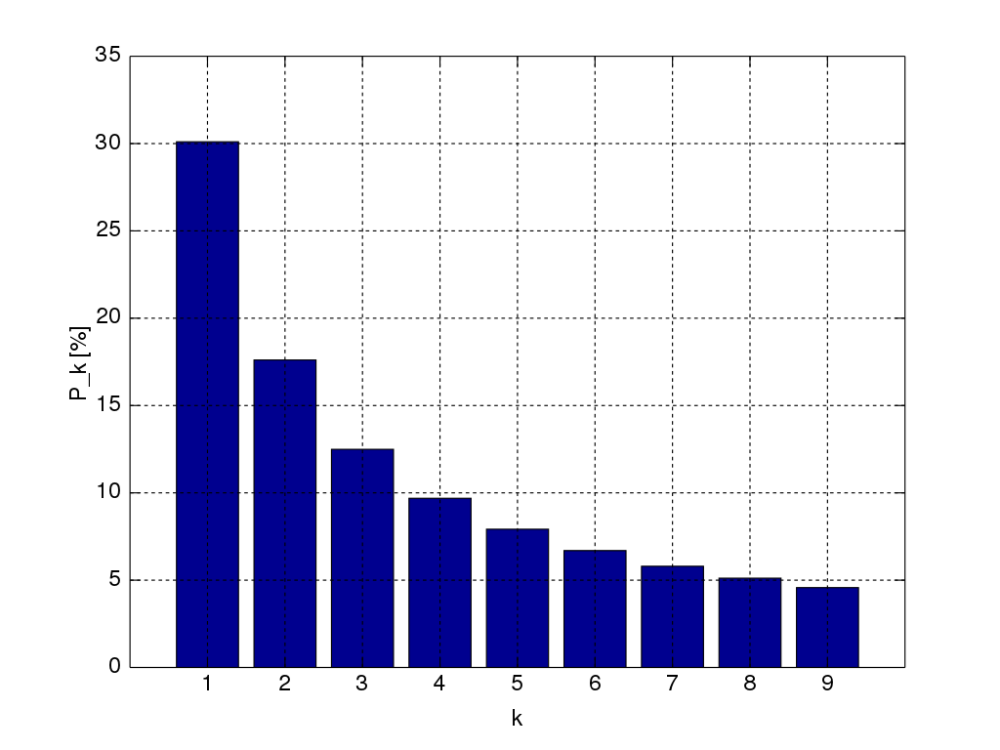

# 9. Strenge 
Vi har tidligere kort introduceret strenge eller strengvariabler som variable, der indeholder tekst, tal eller andre symboler. 
De spiller en central rolle i programmering til at opbevare og operere på data, hvorfor vi har dedikeret nærværende kapitel til at gå i flere detaljer med dem. 

## Strenge som primitive variable og objekter
Vi kan erklære streng-variable på to forskellige måder herunder både som primitive variable og som objekter.  
Herunder eksempler på primitive streng variable ved brug af var og let:

```javascript
var string1 = "Hej med dig"
let string2 = "Hvordan har du det?"
```
Herunder eksempler på erklæring af  streng variable ved brug af var og let men hvor de konstrueres som et string objekt:

```javascript
var string1 = new String("Hej med dig");
let string2 = new String("Hvordan har du det?");
```

Den overordnede syntaks er altså:
```javascript
var val1 = new String(string);
let val2 = new String(string);
```
Bemærk der her er tale om en konstruktør til String klassen og at det String skrives med stort S.

Javascript konverterer automatisk mellem primitive strenge og strenge som objekter, så i praksis kan man reelt undlade at bekymre sig om det.
Men det at strenge faktisk er objekter giver mulighed for at bruge metoder til at tilgå og operere på ens strenge. 

Javascript tilbyder en lang række metoder til at operere og tilgå strenge. Vi vil i det følgende gennemgå nogle af de vigtigste.

## Tæl antal karakterer i en streng
Ofte er det nødvendigt at finde antallet af elementer i en streng. Det kunne eksempelvis være at undersøge om en streng, der skal udgøre et password, har tilpas mange karakterer/tegn. 
Ethvert strengobjekt har en egenskab kaldet length, så antallet af elementer kan tilgås således:

```javascript
let string1 = new String("Er du der?");
console.log("Antallet af elementer i strengen er ", string1.length)
```
Her fås $10$ som output i konsollen, da der med mellemrum og spørgsmålstegn er ti karakterer i alt. 

## Tilgå karakterne i en streng
I nogle tilfælde er det relevant at undersøge enkelte tegn i en given streng. Hvor man i andre sprog kan betragte strenge som arrays, så er det ikke på samme måde tilfældet i Javascript. 
Flere metoder eksisterer dog til at gøre det let at tilgå enkelt elementer i en streng. 

Herunder nogle metoder samt eksempler på anvendelser af dem på strengen fra fra før:

```javascript
//string[n] returnerer den n'te karakter i strengen 'string'
string1[4] // returnerer et 'u'
//string.charAt(index) returnerer karakteren ved det givne index
string1.charAt(0) // returnerer et 'E'
string1.charAt(4)// returnerer et 'u'
//string.indexOf(substr) returnerer første index hvor delstrengen substring forekommer
string1.indexOf("du") //returnerer 3

//string.split(separator) returnerer et array hvor strengen er delt op efter den valgte seperator streng
string1.split(" ") //returnerer arrayet ['Er','du','der?']

//string.trim() returner en trimmet version af strengen hvor mellemrum er fjernet
string1.trim() //returnerer 'Erduder?'

//string.substr(start, length) returnerer de karakterer hvor index starter ved start frem til antallet af karakterer angivet ved length
string.substr(0, 5) //returnerer 'Er du'

//string.slice(start, end) ekstraherer den del af strengen som starter ved index start og slutter ved index end og returnerer den
string.slice(0, 2) //returnerer 'Er '
```


## Sammenkæde strenge
Typiske opgaver med strenge handler om at sammenkæde en eller flere strenge. Det kaldes også med et fint ord for konkatinering. 
Herunder et eksempel:
```javascript
//string1.concat(string2)
string1.concat(" Ja, jeg er her!") //returnerer 'Er du her? Ja, jeg er her!
```

## Store og små bogstaver
I visse sammenhænge kan det være relevant at konvertere strenge til enten store eller små bogstaver. Det kan let gøres ved følgende instruktioner:

```javascript
//string.toLowerCase() returnerer en streng der kun består af små bogstaver
string1.toLowerCase() //returner 'er du der?'
//string.toUpperCase() //returnerer en streng der kun består af store bogstaver
string1.toUpperCase() //returnerer 'ER DU DER?'
```

## Indlæse filer med tekst
Ofte er det nødvendigt at hente data ind fra et andet sted end selve programmet. Det kunne eksempelvis være fra en tekstfil. 
Det gøres med funktionen

```javascript
loadStrings(sti til tekstfilen)
```
Metoden returnerer et array af string hvor hvert element er en linje i tekstfilen. Vær obs på at stien til tekstfilen er korrekt. 
Hvis tekstfilen ligger samme sted som script-filen, så kan du reelt nøjes med at angive hele filnavnet med efternavnet såsom ".txt" eller ".csv" (komma seperaret fil). 

Ofte er vi interesseret i at indlæse inden `setup` eller `draw` afvikles. Det kan vi gøre ved at indsætte det i funktionen `preload()`, som sikrer at koden afvikles inden de to andre kører.

Herunder et eksempel på hvorledes det kan gøres:

```javascript
let lines;
function preload() {
  lines = loadStrings('test.txt');
}

function setup() {
  background(200);
  text(random(lines), 30, 30, 100, 100);
}
```
Metoden `random` udvælger tilfældige elementer i et array. Dvs. tilfældige linjer, som printes på kanvas. 

Hvis man læser en "csv" fil (dvs. en kommaseperaret fil) kan det være en fordel at bruge `loadTable()`. Herunder en forsimplet definition i den forstand, at funktionen kan tage flere parametre, men følgende er nok de mest typiske:
```javascript
loadTable(sti_til_fil, filtype, 'header');
```
Vi bemærker, at `header` kan undværes hvis tekstfilens kommaseperaret kolonner ikke har nogen titel. 

Herunder et eksempel der indlæser en liste af navne og id'er
```javascript
// id,navn
// 0,Martin
// 1,Michella
// 2,Michael
//...

let table;
function preload() {
  //da filen er kommaseperaret og af typen csv:
  table = loadTable('navne.csv', 'csv', 'header');
}

function setup() {
  //tæl antallet af rækker og kolonner
  print(table.getRowCount() + ' antal rækker');
  print(table.getColumnCount() + ' antal kolonner');
  print(table.getColumn('name'));
  //["Martin", "Michella", "Michael"]

  //itererer gennem tabellen
  for (let r = 0; r < table.getRowCount(); r++)
    for (let c = 0; c < table.getColumnCount(); c++) {
      print(table.getString(r, c));
    }

}
```


## Øvelser
Herunder en række øvelser. Som minimum bør du lave 1.-4., 7.-9. samt et af projekterne. 

1. Følgende øvelser skal træne dig i at manipulere med og operere på tekststrenge. 
    1. Skriv et program der konstruerer 3 tekst variabler, som rummer teksterne “Der var engang”, “ en mand som” og “boede i en spand. Spanden var af ler”. 
    2. Sammenkæd de tre tekststrenge via variablerne
    3. Bestem længden af hver af dem.
    4. Undersøg det andet bogstav i hver af dem
    5. Undersøg om to af variablerne er det samme
    6. Skriv hele teksten som versaler
    7. Lav en ny variable der er en delstreng af en af variablerne.
    8. Sammenflet de tre variabler så det første bog stav er fra den første variable, den anden fra den anden osv.
    9. Undersøg hvor mange forekomster af "e" der er i teksten.
  
2. Herunder en række små delopgaver, hvor strenge skal undersøges og manipuleres:
    1. Skriv et program, der finder alle de store bogstaver og små bogstaver i en streng.
    2. Skriv et program, der finder alle mellemrum
    3. Skriv et program, der undersøger hvor mange forskellige bogstaver to strenge har.
    4. Skriv et program, der erstatter alle bogstaver “i” med “k” i en streng.
    5. Skriv et program, der undersøger om en given delstreng er indeholdt i en anden streng
3. Skriv et program, der tager en tekststreng indlæst i en variable. Teksten skal bestå af mindst 100 ord og split ordene op i en liste ved brug af split-funktionen.
   1. Tæl antallet af kommaer og punktummer
   2. Find det ord der forekommer flest gange
   3. Lav en liste der viser hvor mange gange hvert ord forekommmer
4. Lav en knap der genererer et 'sikkert' password. Ved sikkert forstås, at det skal være minimum 8 bogstaver langt samt indeholde både et stort og lille bogstav samt et tal. Udvid selv med et relevant kriterie.  
5. Lav et tekst input felt hvor det forventes, at man indtaster et sikkert password. Giv brugeren besked hvis det er tilfældet eller ej. Ved sikkert forstås definitionen fra forrige opgave. 
6. Skriv et program, der givet en tekststreng med 10 cifre undersøger strengen udgør et validt CPR-NR. Bemærk valid betyder bare, at den overholder dag, måned og år format samt at alle 10 tegn er tal.
7. Skriv et program, der oplister alle CPR-numre i konsollen. Du behøver ikke rent faktisk at printe dem alle, men skrive et program, der systematisk kan printe dem allesammen, hvis det fik tid nok.
8. Skriv et program, der genererer lotto-tallene og tegner dem på kanvas.  
9. Lav en bogstavsky ud fra et tekst inputfelt. Dvs. brugeren indtaster nogle ord/bogstaver og på baggrund heraf genereres en sky af bogstaverne. Jo flere gange et bogstav forekommer jo større bliver det vist. 
10. Lav et tekstfelt og undersøg om input fra brugeren er et palindrom. Dvs. hvorvidt der ordet læses ens forfra og bagfra. Bemærk at det kan gøres ret kort ved at bruge rekursion.
11. Lav et 'Hang-man' spil eller 'gæt et bogstav', hvor et ords bogstaver er markeret med stjerner og ved at gætte bogstaver via et inputfelt, erstattes stjerne med de faktiske bogstaver. For hver gang der gættes forkert tegnes dele af en hængt mand. Man er også velkommen til at lave sin egen illustration.
12. Konstruer et array af sætninger gerne således at brugeren selv kan tilføje input til arrayet. På baggrund heraf skal konstrueres et Haiku-digt. Et Haiku-digt består af 17 stavelser fordelt på 5-7-5 i de tre linjer. 
13. Lav to tekstfelter hvor brugeren kan indtaste tekst, der skal krypteres hhv tekst der skal dekrypteres. Implementer en selvvalgt kryptering. Det kan eksempelvis være at bytte om på rækkefølgen af bogstaver.
14. Lav igen to tekstfelter. Overvej og implementer en selvvalgt metode, der rapporterer hvor sammenlignelige de to strenge er. Dvs. en form for plagiatkontrol. 
15. Lav to tekstfelter. Den ene bruges som kilde til at søge i efter den anden. Rapporter alle de steder hvor den søgte tekststreng forekommer i kilden. Giv mulighed for at man kan erstatte den søgte streng med en anden streng.
16. Lav et tekstfelt hvor brugeren kan skrive en sætning. Prøv at lav en simpel analyse af sætningens sentiment og rapporter hvorvidt sætningen er positivt eller negativt ladet. 
17. Zipfs lov for forkortelser er en empirisk lov/princip, der foreskriver, at jo oftere et ord bruges i en tekst, jo kortere er ordet. Og omvendt. Jo sjældnere et ord bruges, jo længere er det typisk. Lav et program, der analyserer og visualiserer de 10 mest forekomne ord og de 10 mindst forekomne ord. Visualiser antallet af ord. Du vælger selv teksten men den skal indlæses fra en fil vha af `loadString()` metoden. 
18. Brug metoden `loadTable()` til at indlæse en tabel fra en selvvalgt csv fil. Det kan eksempelvis være fra Danmarks Statistik eller lignende. Kravet er at tabellen skal have nogle kolonner med data. Prøv at udføre nogle beregninger på kolonnerne/rækkerne. Det kunne eksempelvis være fra deskriptiv statistik såsom gennemsnittet, hyppighed, medianen, øvre og nedre kvartiler. Det afgørende er at træne din forståelse af at bruge tabeller. 


## Projekt: Lix-tallet
Lixtallet er et udtryk for en teksts læsbarhed. Formlen til at beregne LIX-tallet er givet ved 
 
 $$LIX = \frac{O}{P}+ \frac{L*100}{O}, $$
 hvor $O$ er antal ord i teksten,  $P$ er antal punktummer i teksten og $L$ antal lange ord (over 6 bogstaver lange).

Formlen kan altså forstås som antal ord per mellem hvert punktum lagt sammen med procentdelen af de lange ord i teksten. Man har så følgende skala til at vurdere LIX-tallet med:

$LIX\geq 55$: Meget svær, faglitteratur på akademisk niveau, lovtekster.

$45\leq LIX \geq 55$: Svær, f.eks. saglige bøger, populærvidenskabelige værker, akademiske udgivelser.

$35\leq LIX \geq 45$: Middel, f.eks. dagblade og tidsskrifter.

$25\leq LIX \geq 35$: Let for øvede læsere, f.eks. ugebladslitteratur og skønlitteratur for voksne.

$LIX < 25$: Let tekst for alle læsere, f.eks. børnelitteratur.

Lav et program, der bestemmer Lix-tallet af en tekststreng. Programmet skal fortælle hvilket niveau teksten ligger på. Antag at du får teksten i en string-variable.

Benyt din LIX-beregner på en selvvalgt tekst, som du indlæser. Giver resultatet mening?

## Projekt: Blindskrift Tester
I dette projekt skal du udvikle et simpelt system til at teste hvor hurtig man er til at skrive blindskrift. Dvs. en tekst skal rulle henover skærmen mens man skriver og programmet skal registrere hvor mange ord man når at taste samt hvor mange fejl, der er, indenfor et givent tidsrum.
Udvid systemet så man kan vælge forskellige typer tekst at indtaste ud fra tekstens lixtal.

## Projekt: Benfords lov
Benfords lov (eller måske mere præcist princip) fortæller noget om hvilke cifre, der hyppigst vil forekomme f.eks. fra lister  dagligdagen, såsom husnumre, priser, indbyggertal, længder på floder, aktiekurser etc. 
Formlen er givet ved:
$$P(d)=log(d+1)-log(d)$$
hvor `P` er sandsynligheden for at det ledende tal er `d` og `log` er 10-tals logaritmen. Herunder en illustration af Benfords lov:


Eksempelvis så siger loven, at `1` vil forekomme seks gange så ofte som `8`. 

Skriv et program der kan teste Benfords lov for forskellige data. Prøv den af på forskellige datasæt f.eks. fra Danmarks Statistik eller data i medierne på nettet. Du må meget gerne læse data ind via eksempelvis `loadTable()`metoden. 


## Projekt: ELIZA Chatbot - Kan Turing-testen bestås?
Chatbots er blevet enormt populære og vi møder dem alle steder, når vi eksempelvis chatter med webshops, banker og forsikringsselskaber, så er det første vi er i kontakt med typisk en chatbot. Chatbots kan typiske svare på de mest almindelige spørgsmål også sende folk videre hvis det er nødvendigt. 
I det følgende skal vi lave en simpel chatbot, Eliza, som blev 
udviklet tilbage i 60'erne på MIT Artificial Intelligence Laboratory af Joseph Weizenbaum. 

ELIZA simulerede en samtale ved at bruge grundlæggende  mønstergenkendelse og erstatning af ord, som gav brugeren en oplevelse af at blive forstået af maskinen, til trods for at programmet overhovedet ikke havde nogen forståelsesramme for miljø og hændelser.

I sin helt enkle form fungerer  ELIZA på følgende måde:
1.	Først konstrueres en  prioriteret liste af nøgleord, som benyttes overfor input. Nøgleordet med højest prioritet, som findes i brugerens sætning, anvendes. Eksempler på nøgleord kunne være:
    1.	"kan du" → svar 1-3 anvendes
    2.	"kan jeg" → svar 4-5 anvendes
    3.	"du er" → svar 6-9 anvendes
    4.	...
    5.	(ikke fundet) → svar 106-112 anvendes
2.Nøgleordet har ledt til et sæt af svar; et af disse vælges tilfældigt. Fx kan svarene til "kan du" være:
    1.	    "Tror du ikke jeg kan ...?"
    2.	"Du vil måske gerne være i stand til at ...?"
    3.	"Du vil gerne, om jeg kan ...?)
3.	Vi kan komplicere svaret ved at indsætte den del, som kommer efter nøgleordet. .
4.	Ydermere så vendes svaret således, at 1. person (jeg, mig) erstattes af 2. person (du, dig) og omvendt. 

Implementer ELIZA i sin mest enkle form. Implementer desuden en simpel brugergrænseflade.
Udvid gerne chatbotten så meget som du nu lyster. F.eks. kan det undgås, at samme svar for det enkelte nøgleord anvendes flere gange i træk, og der kan indarbejdes en særlig håndtering af korte svar fra brugeren. Man kan også inddrage andre heuristikker, såsom at chatbotten udvælger  respons fra et valg af predefineret svar. 
